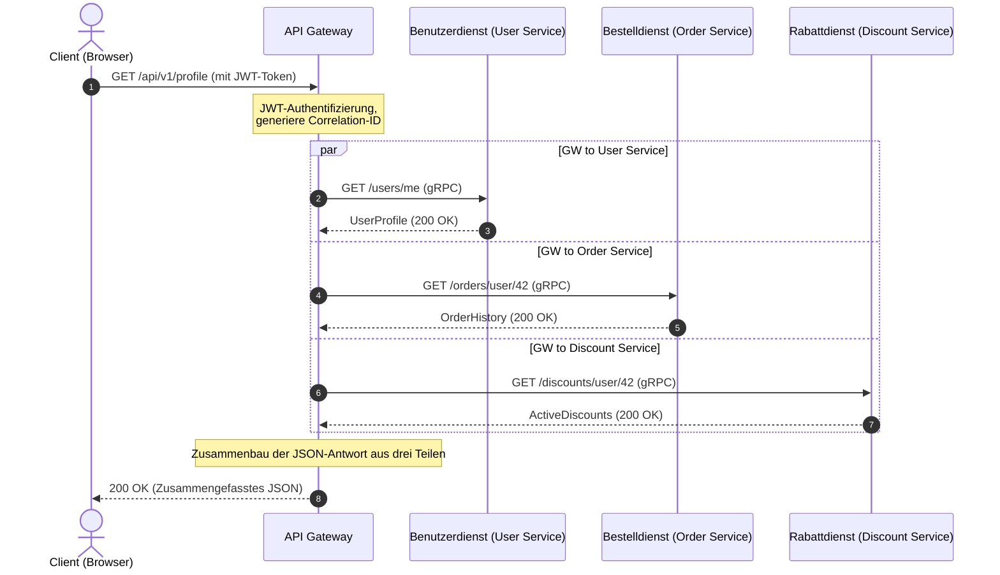

# Vom Monolithen zu Microservices: Lebenszyklus von Requests, Datenaggregation und Fehlertoleranz

Stellen Sie sich vor: Black Friday, Spitzenverkehr. Plötzlich reagiert der Warenkorb nicht mehr, und kurz darauf bricht die gesamte Website zusammen. Der Grund? Einer der Empfehlungsserver verlangsamte sich aufgrund eines Speicherlecks um 5 Sekunden. In einem Monolithen würde dies den Thread-Pool des Webservers überlasten und das gesamte System lahmlegen. In verteilten Systemen ohne angemessenen Schutz führt ein solcher Ausfall zu einer kaskadierenden Lawine: Das API-Gateway bleibt in Erwartung der Empfehlungen hängen, hält die Benutzerverbindungen offen und erschöpft in Sekundenschnelle alle Ressourcen.

Der Übergang vom Monolithen zu Microservices wird oft als Allheilmittel angepriesen. Skalierbarkeit hat jedoch ihren Preis in Form von Komplexität. Anstelle einer einzelnen Datenbank mit schnellen JOIN-Abfragen erhalten wir eine Database-per-Service-Architektur. Um nun eine einzige Profilseite anzuzeigen, müssen wir Daten vom Benutzerdienst (Profil), Bestelldienst (Bestellverlauf) und Rabattdienst (Treuestatus) sammeln. Wie organisieren wir diesen Datenaggregationsprozess, ohne unser System in einen langsamen und fragilen „verteilten Monolithen“ zu verwandeln?

Eine effiziente Datenaggregation in einer serviceorientierten Architektur erfordert eine intelligente Orchestrierung auf der Ebene des API Gateways, die parallele Anfrageausführung und proaktive Fehlerisolierung über Timeouts und Circuit Breaker nutzt.

## Inhaltsverzeichnis
* [Aufteilung des Monolithen: Von einer Datenbank zu isolierten Diensten](#decomposing-monolith)
* [API Gateway als Orchestrator und Aggregator](#api-gateway-role)
* [Lebenszyklus eines Requests bei der Datenaggregation](#request-lifecycle)
* [Synchrones gRPC vs. Asynchrones RabbitMQ](#grpc-vs-rabbitmq)
* [Resilience-Muster: Circuit Breaker und Timeouts](#resilience-patterns)
* [Skalierung von Dienstinstanzen unter Last](#scaling-services)
* [Praktisches Beispiel in PHP](#php-demonstration)
* [Typische Fehler](#common-mistakes)
* [Selbsttest-Quiz](#self-check)

---

<a id="decomposing-monolith"></a>
## Aufteilung des Monolithen: Von einer Datenbank zu isolierten Diensten

In einer monolithischen Anwendung erfolgt der Aufruf einer Methode einer anderen Klasse sofort im Speicher des Prozesses. Wenn wir den Monolithen in Microservices aufteilen, wird jeder Dienst zu einem autonomen Prozess mit eigenem Lebenszyklus und eigener Datenbank.

Dies bedeutet, dass klassische relationale JOIN-Abfragen zwischen Tabellen verschiedener Domänen nicht mehr möglich sind. Der Versuch eines Microservices, direkt aus der Datenbank eines anderen Dienstes zu lesen, verletzt die Grenzen des Bounded Contexts und schafft eine enge Kopplung auf Datenbankschema-Ebene. Ändert sich das Schema der Bestelldatenbank, bricht der Benutzerdienst zusammen.

Daten müssen daher ausschließlich über öffentliche Service-APIs abgefragt werden. Dies führt zum Problem mehrerer Netzwerkaufrufe (Network Roundtrips) und Overhead bei der Serialisierung/Deserialisierung von Daten.

---

<a id="api-gateway-role"></a>
## API Gateway als Orchestrator und Aggregator

Um das clientseitige Sammeln von Daten zu lösen, wird das **API Gateway Pattern** verwendet. Anstatt dass die mobile App oder der Browser 5–10 Anfragen an verschiedene Microservices senden, senden sie eine einzige Anfrage an das Gateway, das die Datenaggregation auf dem Backend durchführt.

### Beliebte API Gateways:
*   **Kong** (basiert auf Nginx und Lua/Go) — hochgradig erweiterbar mit einem reichhaltigen Ökosystem von Plugins.
*   **KrakenD** (in Go geschrieben) — ultraschnell, optimiert für deklarative Datenaggregation ohne Code schreiben zu müssen.
*   **Tyk** (in Go geschrieben) — flexibles Gateway mit nativer GraphQL-Aggregationsunterstützung.
*   **APISIX** (von Apache) — dynamisches Gateway basierend auf OpenResty.

### Worin sollte man ein API Gateway schreiben?
Obwohl die Versuchung groß ist, ein API Gateway in PHP zu schreiben, werden Gateways in der Praxis meist in **Go, Rust oder Node.js/C++** geschrieben.

PHP ist in seinem klassischen Ausführungsmodell (FPM) blockierend: Ein Worker-Prozess verarbeitet einen Request. Wenn ein PHP-API-Gateway drei Microservices parallel abfragt, muss es curl multi oder ReactPHP/Swoole verwenden. Go und Rust bieten jedoch native Unterstützung für nicht-blockierende E/A (asynchrone Sockets) und leichtgewichtige Threads (Goroutinen). Dadurch können sie Hunderttausende paralleler Verbindungen mit minimalem RAM-Verbrauch und Latenzen unter 1 Millisekunde verarbeiten.

---

<a id="request-lifecycle"></a>
## Lebenszyklus eines Requests bei der Datenaggregation

Verfolgen wir den Weg einer Anfrage für die Seite „Benutzerprofil-Dashboard“:



1.  **Der Client sendet eine Anfrage** an den Endpunkt `GET /api/v1/profile` mit einem JWT-Autorisierungstoken.
2.  **Das API Gateway empfängt die Anfrage**, validiert das JWT-Token, extrahiert die Benutzer-ID (z. B. `42`) und generiert eine eindeutige `Correlation-ID` (oder `Trace-ID`), die an die Header aller nachfolgenden nachgelagerten Anfragen für die verteilte Ablaufverfolgung angehängt wird.
3.  **Parallele Anfrage-Orchestrierung:** Das Gateway startet drei parallele, nicht-blockierende Threads (oder Goroutinen), um nachgelagerte Microservices aufzurufen:
    *   `GET /users/42`
    *   `GET /orders/user/42`
    *   `GET /discounts/user/42`
4.  **Ergebnisse zusammenführen:** Der Aggregator des Gateways wartet auf den Abschluss aller Aufrufe.
    *   *Szenario A (alle erfolgreich):* Alle Antworten gehen innerhalb von 50 ms ein. Das Gateway baut ein einzelnes JSON-Dokument zusammen und sendet es an den Client zurück.
    *   *Szenario B (Ausfall):* Der Rabattdienst fällt mit einem 500-Fehler aus. Der Orchestrator fängt den Fehler ab, wendet ein *Fallback*-Muster an (z. B. fügt eine leere Rabattliste ein) und gibt das Benutzerprofil und die Bestellungen an den Benutzer zurück, ohne die gesamte Seite zu beschädigen.

---

<a id="grpc-vs-rabbitmq"></a>
## Synchrones gRPC vs. Asynchrones RabbitMQ

Microservices kommunizieren über zwei Hauptmuster:

### 1. Synchrone Kommunikation (gRPC, HTTP/REST)
Wird verwendet, wenn sofort eine Antwort benötigt wird (wie bei der Datenaggregation am API-Gateway).
*   **gRPC** läuft über **HTTP/2** und verwendet **Protocol Buffers (protobuf)** für die binäre Serialisierung. Es ist dank Multiplexing von Anfragen über eine einzelne TCP-Verbindung und Header-Komprimierung erheblich schneller als das klassische JSON über HTTP/1.1.

### 2. Asynchrone Kommunikation über Message Broker (RabbitMQ, Kafka)
Wird für Operationen verwendet, die keine sofortige Antwort erfordern (z. B. Bestellung aufgeben, E-Mails senden, Statistiken aktualisieren).
*   Wenn ein Benutzer auf „Bestellung aufgeben“ klickt, sendet das API-Gateway eine Anfrage an den Bestelldienst. Der Bestelldienst schreibt die Bestellung in seine DB und veröffentlicht ein `OrderCreated`-Ereignis in RabbitMQ.
*   Der Benachrichtigungsdienst und der Lieferdienst haben diese Warteschlange abonniert. Sie lesen das Ereignis asynchron und beginnen mit der Verarbeitung. Der Bestelldienst antwortet dem Client sofort: „Bestellung zur Bearbeitung angenommen“.

---

<a id="resilience-patterns"></a>
## Resilience-Muster: Circuit Breaker und Timeouts

In einem verteilten System sind Netzwerkausfälle unvermeidlich. Ohne Schutzmaßnahmen kann eine Verzögerung in einem einzelnen Dienst schnell die gesamte Aufrufkette lähmen.

```
Ohne Circuit Breaker:
[API Gateway] --(wartet 30s)--> [Hängender Dienst] --> Thread-Pool erschöpft --> Systemausfall ❌

Mit Circuit Breaker:
[API Gateway] --(Dienst fällt aus)--> [Circuit Breaker (Open)] --> Sofortige Fallback-Antwort (50ms) ⚠️
```

### Wichtige Resilience-Muster:
1.  **Timeouts:** Keine nachgelagerte Anfrage sollte unbegrenzt blockieren (z. B. maximal 500 ms). Antwortet ein Dienst nicht innerhalb des Limits, wird die Verbindung abgebrochen.
2.  **Circuit Breaker (Schutzschalter):** Ein Zustandsautomat mit drei Zuständen:
    *   *Closed (Geschlossen):* Anfragen fließen normal zum Dienst.
    *   *Open (Offen):* Wenn die Fehlerrate einen Schwellenwert überschreitet (z. B. 50 % innerhalb einer Minute), öffnet sich der Schaltkreis. Nachfolgende Anfragen werden sofort auf Gateway-Ebene abgelehnt, ohne das Netzwerk zu belasten. Dies gibt dem ausgefallenen Dienst Zeit zur Erholung.
    *   *Half-Open (Halboffen):* Nach einer Abkühlzeit lässt das Gateway einige Testanfragen durch. Wenn diese erfolgreich sind, schließt sich der Schaltkreis.
3.  **Retries (Wiederholungen):** Erneutes Senden von Anfragen bei vorübergehenden Netzwerkfehlern. Es ist wichtig, Exponential Backoff mit Jitter (zufälliges Rauschen) zu verwenden, um den sich erholenden Dienst nicht mit Anfragen zu überfluten.
4.  **Fallback:** Ein alternativer Ausführungspfad. Wenn der Empfehlungsdienst offline ist, gibt das Gateway eine statische Liste beliebter Artikel zurück.

---

<a id="scaling-services"></a>
## Skalierung von Dienstinstanzen unter Last

Bei Verkehrsspitzen können einzelne Microservices zu Engpässen werden. Um sie dynamisch zu skalieren, werden folgende Mechanismen eingesetzt:

*   **Service Discovery (Dienstregistrierung):** Wenn eine neue Instanz des Bestelldienstes in Docker/Kubernetes gestartet wird, registriert sie sich bei einer Dienstregistrierung (z. B. *Consul, Eureka* oder Kubernetes DNS). Das API-Gateway fragt die Registrierung ab, um aktive IP-Adressen zu erhalten.
*   **Load Balancing (Lastverteilung):** Das Gateway verteilt Anfragen auf Dienstinstanzen mithilfe von Algorithmen wie *Round Robin* oder *Least Connections*.
*   **Autoscaling (Automatische Skalierung):** Kubernetes HPA (Horizontal Pod Autoscaler) überwacht Metriken (CPU-, RAM-Auslastung oder Requests Per Second) und fährt automatisch neue Container hoch, wenn Schwellenwerte überschritten werden.

---

<a id="php-demonstration"></a>
## Praktisches Beispiel in PHP

In einer Laravel-Anwendung können wir den HTTP-Client-Pool verwenden, um parallele, nicht-blockierende Anfragen an nachgelagerte Dienste zu senden. Er nutzt im Hintergrund das curl multi-Interface von Guzzle.

Hier ist eine PHP-Implementierung eines Aggregator-Dienstes mit Timeout-Limits und Fallback-Logik.

```php
// app/Services/MicroserviceAggregator.php
declare(strict_types=1);

namespace App\Services;

use Illuminate\Http\Client\Pool;
use Illuminate\Support\Facades\Http;
use Illuminate\Support\Facades\Log;

class MicroserviceAggregator
{
    private string $userServiceUrl;
    private string $orderServiceUrl;
    private string $discountServiceUrl;

    public function __construct()
    {
        $this->userServiceUrl = config('services.microservices.user_url', 'http://user-service');
        $this->orderServiceUrl = config('services.microservices.order_url', 'http://order-service');
        $this->discountServiceUrl = config('services.microservices.discount_url', 'http://discount-service');
    }

    /**
     * Sammelt vollständige Benutzerprofildaten parallel.
     *
     * @param int $userId Die Benutzer-ID
     * @param string $correlationId Correlation-ID zur verteilten Ablaufverfolgung
     * @return array<string, mixed>
     */
    public function getAggregatedProfileData(int $userId, string $correlationId): array
    {
        $headers = [
            'X-Correlation-ID' => $correlationId,
            'Accept' => 'application/json',
        ];

        // Führe parallele, nicht-blockierende Anfragen aus
        $responses = Http::pool(fn (Pool $pool) => [
            $pool->as('user')
                ->withHeaders($headers)
                ->timeout(1) // Timeout nach 1 Sekunde
                ->get("{$this->userServiceUrl}/users/{$userId}"),

            $pool->as('orders')
                ->withHeaders($headers)
                ->timeout(2) // Timeout nach 2 Sekunden
                ->get("{$this->orderServiceUrl}/orders/user/{$userId}"),

            $pool->as('discounts')
                ->withHeaders($headers)
                ->timeout(1) // Timeout nach 1 Sekunde
                ->get("{$this->discountServiceUrl}/discounts/user/{$userId}"),
        ]);

        // 1. Benutzerprofil verarbeiten (Kritischer Dienst)
        $userResponse = $responses['user'];
        if ($userResponse->failed()) {
            Log::error("Aggregator: Failed to fetch user profile", [
                'userId' => $userId,
                'correlationId' => $correlationId,
                'status' => $userResponse->status(),
                'error' => $userResponse->body()
            ]);

            // Wenn der kritische Dienst ausfällt, müssen wir abbrechen
            throw new \RuntimeException("Critical microservice (User Service) is unavailable.");
        }
        $userProfile = $userResponse->json();

        // 2. Bestellungen verarbeiten (Nicht kritisch: Fallback zu leerem Array bei Fehler)
        $ordersResponse = $responses['orders'];
        $orders = [];
        if ($ordersResponse->successful()) {
            $orders = $ordersResponse->json();
        } else {
            Log::warning("Aggregator: Failed to fetch orders, applying fallback", [
                'userId' => $userId,
                'correlationId' => $correlationId,
                'status' => $ordersResponse->status()
            ]);
        }

        // 3. Rabatte verarbeiten (Nicht kritisch: Fallback bei Fehler)
        $discountsResponse = $responses['discounts'];
        $discounts = [];
        if ($discountsResponse->successful()) {
            $discounts = $discountsResponse->json();
        } else {
            Log::warning("Aggregator: Failed to fetch discounts, applying fallback", [
                'userId' => $userId,
                'correlationId' => $correlationId,
                'status' => $discountsResponse->status()
            ]);
        }

        // Aggregierte Datenstruktur zurückgeben
        return [
            'user' => $userProfile,
            'orders' => $orders,
            'discounts' => $discounts,
            'aggregated_at' => now()->toIso8601String(),
        ];
    }
}
```

---

<a id="common-mistakes"></a>
## ⚠️ Typische Fehler

**1. Synchrone Anfrageketten**
Das synchrone Aufrufen von `Gateway -> Service A -> Service B -> Service C` macht den Zweck von Microservices zunichte. Die Gesamtreaktionszeit wird zur Summe aller Dienstlatenzen, und jeder Ausfall bricht die gesamte Kette. Bevorzugen Sie parallele Anfragen oder asynchrone (eventgesteuerte) Kommunikation.

**2. Unbegrenzte Standard-Timeouts**
Wenn keine Timeouts für Netzwerkanfragen konfiguriert sind, hält das Gateway Verbindungen für nicht reagierende nachgelagerte Dienste offen. Unter hoher Last führt dies zu Thread-Starvation und stürzt das Gateway ab.

**3. Fehlende Correlation-IDs**
Ohne eine Trace-ID ist das Debuggen verteilter Probleme fast unmöglich. Das API-Gateway muss jedem eingehenden Request eine eindeutige Correlation-ID zuweisen, diese an alle nachgelagerten Aufrufe übergeben und in allen Protokolleinträgen enthalten.

---

<a id="self-check"></a>
## 🧠 Selbsttest-Quiz

1. Welches Transportprotokoll und Serialisierungsformat verwendet gRPC, um die Leistung gegenüber REST JSON zu verbessern?
2. Warum wird Go gegenüber dem klassischen PHP-FPM für hochbelastete API-Gateways bevorzugt?
3. In welchen Zustand wechselt ein Circuit Breaker, wenn ein nachgelagerter Dienst dauerhaft 500-Fehler zurückgibt?

<details>
<summary><b>Antworten anzeigen</b></summary>

1. gRPC verwendet **HTTP/2** als Transportprotokoll (für multiplexierte, persistente Verbindungen) und **Protocol Buffers (protobuf)** für die binäre Serialisierung anstelle von Klartext-JSON.
2. Go implementiert nativ eine nicht-blockierende Ereignisschleife auf System-Sockets und leichtgewichtige Threads (Goroutinen). Dadurch kann es Millionen von Verbindungen gleichzeitig mit sehr wenig RAM verarbeiten. PHP-FPM erzeugt für jede einzelne eingehende Verbindung einen schweren Betriebssystemprozess, was bei massiver Parallelität schlecht skaliert.
3. Der Circuit Breaker wechselt in den Zustand **Open (Offen)**, wodurch alle nachfolgenden Anfragen an den ausgefallenen Dienst sofort abgelehnt werden, ohne eine Netzwerkanfrage zu senden, und stattdessen eine Fallback-Antwort zurückgegeben wird.
</details>
