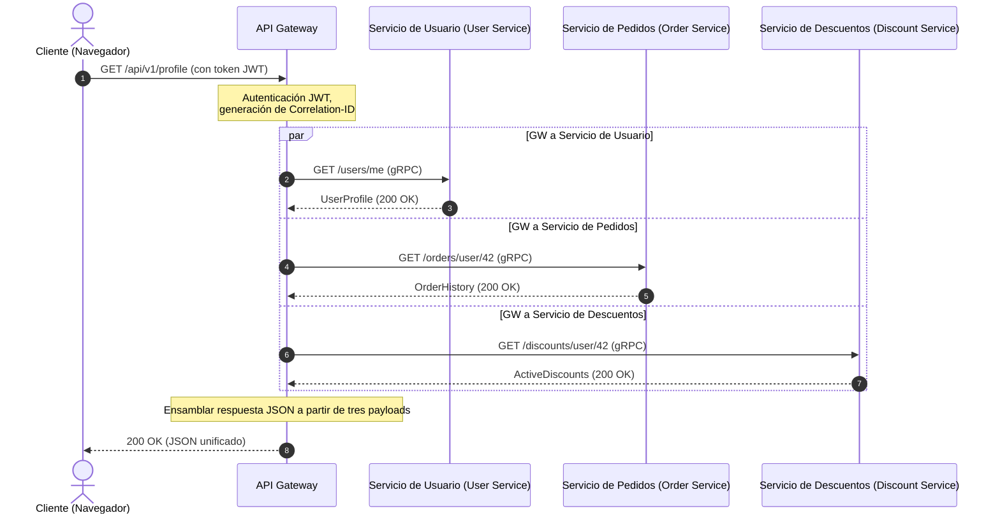

# Del monolito a los microservicios: Ciclo de vida de la solicitud, agregación de datos y tolerancia a fallos

Imagine esto: Black Friday, pico de tráfico. De repente, el carrito de compras del usuario deja de responder y todo el sitio web se cae. ¿El culpable? Uno de los servidores de recomendación se ralentizó 5 segundos debido a una fuga de memoria. En un monolito, esto llenaría el pool de hilos del servidor web y detendría todo el sistema. En un sistema distribuido sin las salvaguardas adecuadas, un fallo de este tipo desencadena una avalancha en cascada: el API Gateway se queda colgado esperando las recomendaciones, reteniendo las conexiones de los usuarios y agotando todos los recursos del sistema en segundos.

La transición de un monolito a microservicios a menudo se anuncia como una solución mágica. Sin embargo, la escalabilidad tiene el costo de la complejidad. En lugar de una única base de datos con consultas JOIN rápidas, obtenemos una arquitectura de Base de datos por servicio (Database-per-Service). Ahora, para renderizar una sola página de perfil, debemos obtener datos del Servicio de Usuario (User Service), del Servicio de Pedidos (Order Service) y del Servicio de Descuentos (Discount Service). ¿Cómo orquestamos este proceso de agregación de datos sin convertir nuestro sistema en un monolito distribuido lento y frágil?

Una agregación de datos eficiente en una arquitectura orientada a servicios requiere una orquestación inteligente a nivel de API Gateway, utilizando la ejecución de solicitudes en paralelo y el aislamiento proactivo de fallos mediante tiempos de espera (timeouts) y disyuntores (circuit breakers).

## Tabla de contenidos
* [Descomponer el monolito: De una base de datos única a servicios aislados](#decomposing-monolith)
* [El API Gateway como orquestador y agregador](#api-gateway-role)
* [Ciclo de vida de la solicitud en la agregación de datos](#request-lifecycle)
* [gRPC síncrono vs RabbitMQ asíncrono](#grpc-vs-rabbitmq)
* [Patrones de resiliencia: Disyuntor y tiempos de espera](#resilience-patterns)
* [Escalar instancias de servicio bajo carga](#scaling-services)
* [Ejemplo práctico en PHP](#php-demonstration)
* [Errores comunes](#common-mistakes)
* [Prueba de autoevaluación](#self-check)

---

<a id="decomposing-monolith"></a>
## Descomponer el monolito: De una base de datos única a servicios aislados

En una aplicación monolítica, llamar a un método de otra clase ocurre instantáneamente dentro de la misma memoria del proceso. Cuando dividimos un monolito en microservicios, cada servicio se convierte en un proceso autónomo con su propio ciclo de vida y su propia base de datos privada.

Esto significa que las consultas JOIN relacionales clásicas entre tablas de diferentes dominios ya no son posibles. Permitir que un microservicio lea directamente de la base de datos de otro servicio viola los límites del contexto acotado (Bounded Context) y crea un acoplamiento fuerte a nivel de esquema. Si el esquema de la base de datos de pedidos cambia, el servicio de usuario se rompe.

Por lo tanto, los datos deben solicitarse exclusivamente a través de las API públicas de los servicios. Esto introduce el problema de múltiples viajes de ida y vuelta por la red (network roundtrips) y la sobrecarga de serialización/deserialización.

---

<a id="api-gateway-role"></a>
## El API Gateway como orquestador y agregador

Para resolver el desafío de la recopilación de datos del lado del cliente, utilizamos el **patrón API Gateway**. En lugar de que una aplicación móvil o un navegador realicen de 5 a 10 solicitudes a diferentes microservicios, realizan una sola solicitud al gateway, que realiza la agregación de datos en el backend.

### API Gateways populares:
*   **Kong** (basado en Nginx y Lua/Go): altamente extensible con un rico ecosistema de complementos (plugins).
*   **KrakenD** (escrito en Go): ultrarrápido, optimizado para la agregación declarativa de datos sin escribir código.
*   **Tyk** (escrito en Go): gateway flexible con soporte nativo para agregación GraphQL.
*   **APISIX** (por Apache): gateway dinámico basado en OpenResty.

### ¿En qué deberíamos escribir un API Gateway?
Aunque la tentación de escribir un API Gateway en PHP es alta, los gateways en producción se escriben típicamente en **Go, Rust o Node.js/C++**.

PHP en su modelo de ejecución clásico (FPM) es bloqueante: un proceso de trabajo (worker) maneja una sola solicitud a la vez. Si un API Gateway en PHP consulta tres microservicios en paralelo, debe usar curl multi o ReactPHP/Swoole. Sin embargo, Go y Rust ofrecen soporte nativo para E/S no bloqueante (sockets asíncronos) e hilos ligeros (goroutines), lo que les permite manejar cientos de miles de conexiones simultáneas con un consumo mínimo de RAM y latencia inferior a 1 milisegundo.

---

<a id="request-lifecycle"></a>
## Ciclo de vida de la solicitud en la agregación de datos

Siguamos la ruta de una solicitud para la página 'Panel de perfil de usuario':



1.  **El cliente envía una solicitud** al endpoint `GET /api/v1/profile` con un token de autorización JWT.
2.  **El API Gateway recibe la solicitud**, valida el token JWT, extrae el ID de usuario (por ejemplo, `42`) y genera un ID de correlación único `Correlation-ID` (o `Trace-ID`) que se adjunta a las cabeceras de todas las solicitudes aguas abajo para el rastreo distribuido.
3.  **Orquestación de solicitudes en paralelo:** El gateway genera tres hilos paralelos no bloqueantes (o goroutines) para llamar a los microservicios aguas abajo:
    *   `GET /users/42`
    *   `GET /orders/user/42`
    *   `GET /discounts/user/42`
4.  **Consolidación de resultados:** El agregador del gateway espera a que terminen todas las llamadas.
    *   *Escenario A (todas exitosas):* Todas las respuestas se reciben en un plazo de 50 ms. El gateway ensambla un único documento JSON y lo devuelve al cliente.
    *   *Escenario B (fallo):* El Servicio de Descuentos falla con un error 500. El orquestador captura el error, aplica un patrón de respaldo (*Fallback*, por ejemplo, inserta una lista de descuentos vacía) y devuelve el perfil del usuario y los pedidos al usuario, evitando que se rompa toda la página.

---

<a id="grpc-vs-rabbitmq"></a>
## gRPC síncrono vs RabbitMQ asíncrono

Los microservicios se comunican utilizando principalmente dos patrones:

### 1. Comunicación síncrona (gRPC, HTTP/REST)
Se utiliza cuando se necesita una respuesta de inmediato (como la agregación de datos en el API Gateway).
*   **gRPC** se ejecuta sobre **HTTP/2** y utiliza **Protocol Buffers (protobuf)** para la serialización binaria. Es significativamente más rápido que el JSON clásico sobre HTTP/1.1 gracias a la multiplexación de solicitudes a través de una sola conexión TCP y la compresión de cabeceras.

### 2. Comunicación asíncrona mediante broker de mensajería (RabbitMQ, Kafka)
Se utiliza para operaciones que no requieren una respuesta inmediata (por ejemplo, realizar un pedido, enviar correos electrónicos, actualizar estadísticas).
*   Cuando un usuario hace clic en "Realizar pedido", el API Gateway envía una solicitud al Servicio de Pedidos. El Servicio de Pedidos escribe el pedido en su base de datos y publica un evento `OrderCreated` en RabbitMQ.
*   El Servicio de Notificaciones y el Servicio de Envíos están suscritos a esta cola. Leen el evento de forma asíncrona y comienzan el procesamiento. El Servicio de Pedidos responde inmediatamente al cliente: "Pedido aceptado para procesamiento".

---

<a id="resilience-patterns"></a>
## Patrones de resiliencia: Disyuntor y tiempos de espera

En un sistema distribuido, los fallos de red son inevitables. Sin salvaguardas, la ralentización de un solo servicio puede paralizar rápidamente toda la cadena de llamadas.

```
Sin disyuntor (Circuit Breaker):
[API Gateway] --(espera 30s)--> [Servicio colgado] --> Pool de hilos agotado --> Caída del sistema ❌

Con disyuntor:
[API Gateway] --(servicio fallando)--> [Disyuntor (Abierto)] --> Respuesta de respaldo instantánea (50ms) ⚠️
```

### Patrones clave de resiliencia:
1.  **Tiempos de espera (Timeouts):** Ninguna solicitud aguas abajo debe bloquearse indefinidamente (por ejemplo, máximo 500 ms). Si un servicio no responde dentro del límite, se aborta la conexión.
2.  **Disyuntor (Circuit Breaker):** Una máquina de estados con tres estados:
    *   *Cerrado (Closed):* Las solicitudes fluyen normalmente hacia el servicio.
    *   *Abierto (Open):* Si la tasa de errores supera un umbral (por ejemplo, 50% en un minuto), el circuito se abre. Las llamadas posteriores al servicio se rechazan inmediatamente a nivel del gateway sin realizar solicitudes de red. Esto le da tiempo al servicio fallido para recuperarse.
    *   *Semiabierto (Half-Open):* Después de un período de enfriamiento, el gateway permite pasar algunas solicitudes de prueba. Si tienen éxito, el circuito se cierra.
3.  **Reintentos (Retries):** Reenviar solicitudes durante fallos temporales (timeouts, errores 503). Es crucial utilizar el retroceso exponencial con fluctuación (*Exponential Backoff with Jitter* - ruido aleatorio) para evitar hacer un ataque de denegación de servicio (DDoS) a su propio servicio en recuperación.
4.  **Respaldo (Fallback):** Una ruta de ejecución alternativa. Si el servicio de recomendaciones está caído, el gateway devuelve una lista estática de artículos populares.

---

<a id="scaling-services"></a>
## Escalar instancias de servicio bajo carga

Cuando hay picos de tráfico, los microservicios individuales pueden convertirse en cuellos de botella. Para escalarlos dinámicamente, se utilizan los siguientes mecanismos:

*   **Descubrimiento de servicios (Service Discovery):** Cuando se inicia una nueva instancia del Servicio de Pedidos en Docker/Kubernetes, se registra en un registro de servicios (por ejemplo, *Consul, Eureka* o Kubernetes DNS). El API Gateway consulta el registro para obtener las direcciones IP activas.
*   **Balanceo de carga (Load Balancing):** El gateway distribuye las solicitudes entre las instancias del servicio utilizando algoritmos como *Round Robin* o *Least Connections*.
*   **Escalado automático (Autoscaling):** Kubernetes HPA (Horizontal Pod Autoscaler) monitorea las métricas (uso de CPU, RAM o solicitudes por segundo) y levanta automáticamente nuevos contenedores cuando se superan los umbrales.

---

<a id="php-demonstration"></a>
## Ejemplo práctico en PHP

Dentro de una aplicación Laravel, podemos usar el HTTP-client-pool para enviar solicitudes paralelas no bloqueantes a los servicios aguas abajo. Utiliza el curl multi-interface de Guzzle en segundo plano.

Aquí hay una implementación en PHP de un servicio agregador con límites de tiempo de espera y lógica de respaldo (fallback).

```php
// app/Services/MicroserviceAggregator.php
declare(strict_types=1);

namespace App\Services;

use Illuminate\Http\Client\Pool;
use Illuminate\Support\Facades\Http;
use Illuminate\Support\Facades\Log;

class MicroserviceAggregator
{
    private string $userServiceUrl;
    private string $orderServiceUrl;
    private string $discountServiceUrl;

    public function __construct()
    {
        $this->userServiceUrl = config('services.microservices.user_url', 'http://user-service');
        $this->orderServiceUrl = config('services.microservices.order_url', 'http://order-service');
        $this->discountServiceUrl = config('services.microservices.discount_url', 'http://discount-service');
    }

    /**
     * Rassemble les données complètes du profil utilisateur en parallèle.
     *
     * @param int $userId L'ID de l'utilisateur
     * @param string $correlationId L'ID de corrélation pour le traçage distribué
     * @return array<string, mixed>
     */
    public function getAggregatedProfileData(int $userId, string $correlationId): array
    {
        $headers = [
            'X-Correlation-ID' => $correlationId,
            'Accept' => 'application/json',
        ];

        // Ejecuta solicitudes paralelas no bloqueantes
        $responses = Http::pool(fn (Pool $pool) => [
            $pool->as('user')
                ->withHeaders($headers)
                ->timeout(1) // Tiempo de espera de 1 segundo
                ->get("{$this->userServiceUrl}/users/{$userId}"),

            $pool->as('orders')
                ->withHeaders($headers)
                ->timeout(2) // Tiempo de espera de 2 segundos
                ->get("{$this->orderServiceUrl}/orders/user/{$userId}"),

            $pool->as('discounts')
                ->withHeaders($headers)
                ->timeout(1) // Tiempo de espera de 1 segundo
                ->get("{$this->discountServiceUrl}/discounts/user/{$userId}"),
        ]);

        // 1. Procesar el perfil de usuario (Servicio crítico)
        $userResponse = $responses['user'];
        if ($userResponse->failed()) {
            Log::error("Aggregator: Failed to fetch user profile", [
                'userId' => $userId,
                'correlationId' => $correlationId,
                'status' => $userResponse->status(),
                'error' => $userResponse->body()
            ]);

            // Si el servicio crítico está caído, debemos abortar la solicitud
            throw new \RuntimeException("Critical microservice (User Service) is unavailable.");
        }
        $userProfile = $userResponse->json();

        // 2. Procesar pedidos (No crítico: respaldo a array vacío en caso de fallo)
        $ordersResponse = $responses['orders'];
        $orders = [];
        if ($ordersResponse->successful()) {
            $orders = $ordersResponse->json();
        } else {
            Log::warning("Aggregator: Failed to fetch orders, applying fallback", [
                'userId' => $userId,
                'correlationId' => $correlationId,
                'status' => $ordersResponse->status()
            ]);
        }

        // 3. Procesar descuentos (No crítico: respaldo en caso de fallo)
        $discountsResponse = $responses['discounts'];
        $discounts = [];
        if ($discountsResponse->successful()) {
            $discounts = $discountsResponse->json();
        } else {
            Log::warning("Aggregator: Failed to fetch discounts, applying fallback", [
                'userId' => $userId,
                'correlationId' => $correlationId,
                'status' => $discountsResponse->status()
            ]);
        }

        // Devolver estructura de datos agregados
        return [
            'user' => $userProfile,
            'orders' => $orders,
            'discounts' => $discounts,
            'aggregated_at' => now()->toIso8601String(),
        ];
    }
}
```

---

## ⚠️ Erreurs courantes

**1. Cadenas de solicitudes síncronas**
Llamar síncronamente a `Gateway -> Servicio A -> Servicio B -> Servicio C` anula el propósito de los microservicios. El tiempo de respuesta total se convierte en la suma de las latencias de todos los servicios, y cualquier fallo rompe toda la cadena. Es preferible utilizar solicitudes paralelas o comunicación asíncrona (orientada a eventos).

**2. Tiempos de espera predeterminados indefinidos**
No especificar tiempos de espera de red hace que el gateway mantenga las conexiones abiertas para servicios aguas abajo que no responden. Bajo una gran carga, esto provoca la saturación de los hilos y hace que el gateway se caiga.

**3. Falta de IDs de correlación (Correlation IDs)**
Sin un ID de rastreo (Trace ID), diagnosticar problemas distribuidos es casi imposible. El API Gateway debe asignar un ID de correlación único a cada solicitud entrante, pasarlo a todas las llamadas aguas abajo e incluirlo en todas las registros (logs).

---

## 🧠 Prueba de autoevaluación

1. ¿Qué protocolo de transporte y formato de serialización utiliza gRPC para mejorar el rendimiento en comparación con REST JSON?
2. ¿Por qué se prefiere Go sobre el clásico PHP-FPM para API Gateways de alta carga?
3. ¿A qué estado cambia un disyuntor (Circuit Breaker) cuando un servicio aguas abajo comienza a devolver errores 500 constantemente?

<details>
<summary><b>Mostrar respuestas</b></summary>

1. gRPC utiliza **HTTP/2** como su protocolo de transporte (para conexiones multiplexadas y persistentes) y **Protocol Buffers (protobuf)** para la serialización binaria en lugar de JSON en texto plano.
2. Go implementa de forma nativa un bucle de eventos no bloqueante en los sockets del sistema e hilos ligeros (goroutines), lo que le permite manejar millones de conexiones simultáneas con muy poca RAM. PHP-FPM genera un proceso pesado del sistema operativo para cada conexión entrante, lo que escala con dificultad bajo una alta concurrencia.
3. El disyuntor cambia al estado **Abierto (Open)**, devolviendo instantáneamente un error o una respuesta de respaldo predeterminada a los clientes sin enviar solicitudes al servicio fallido.
</details>
