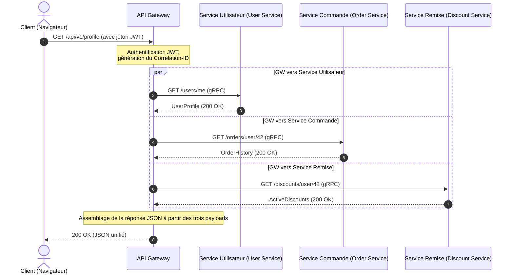

# Du monolithe aux microservices : Cycle de vie des requêtes, agrégation de données et tolérance aux pannes

Imaginez ceci : Black Friday, pic de trafic. Soudain, le panier d'achat de l'utilisateur ne répond plus, et c'est tout le site web qui s'effondre. Le coupable ? L'un des serveurs de recommandation a ralenti de 5 secondes à cause d'une fuite de mémoire. Dans un monolithe, cela saturerait le pool de threads du serveur web et paralyserait tout le système. Dans un système distribué sans garde-fous appropriés, une telle panne déclenche une avalanche en cascade : l'API Gateway se bloque en attendant les recommandations, maintient les connexions des utilisateurs et épuise toutes les ressources du système en quelques secondes.

La transition d'un monolithe vers les microservices est souvent présentée comme une solution miracle. Cependant, la scalabilité se fait au détriment de la complexité. Au lieu d'une base de données unique avec des requêtes JOIN rapides, nous obtenons une architecture de type base de données par service (Database-per-Service). Désormais, pour afficher une seule page de profil, nous devons récupérer des données à partir du service utilisateur (User Service), du service de commande (Order Service) et du service de remise (Discount Service). Comment orchestrer ce processus d'agrégation de données sans transformer notre système en un « monolithe distribué » lent et fragile ?

Une agrégation de données efficace dans une architecture orientée services nécessite une orchestration intelligente au niveau de l'API Gateway, utilisant l'exécution parallèle des requêtes et une isolation proactive des pannes via des délais d'expiration (timeouts) et des disjoncteurs (circuit breakers).

## Table des matières
* [Décomposition du monolithe : D'une base de données unique aux services isolés](#decomposing-monolith)
* [L'API Gateway comme orchestrateur et agrégateur](#api-gateway-role)
* [Cycle de vie d'une requête dans l'agrégation de données](#request-lifecycle)
* [gRPC synchrone vs RabbitMQ asynchrone](#grpc-vs-rabbitmq)
* [Modèles de résilience : Disjoncteur et délais d'expiration](#resilience-patterns)
* [Mise à l'échelle des instances de service sous charge](#scaling-services)
* [Exemple pratique en PHP](#php-demonstration)
* [Erreurs courantes](#common-mistakes)
* [Quiz d'auto-évaluation](#self-check)

---

<a id="decomposing-monolith"></a>
## Décomposition du monolithe : D'une base de données unique aux services isolés

Dans une application monolithique, l'appel d'une méthode à partir d'une autre classe se produit instantanément dans la mémoire du même processus. Lorsque nous divisons un monolithe en microservices, chaque service devient un processus autonome avec son propre cycle de vie et sa propre base de données privée.

Cela signifie que les requêtes JOIN relationnelles classiques sur différentes tables de domaine ne sont plus possibles. Autoriser un microservice à lire directement dans la base de données d'un autre service viole les limites du contexte délimité (Bounded Context) et crée un couplage fort au niveau du schéma. Si le schéma de la base de données des commandes change, le service utilisateur tombe en panne.

Par conséquent, les données doivent être demandées exclusivement via des API de service publiques. Cela introduit le problème des multiples allers-retours réseau (network roundtrips) et du surcoût lié à la sérialisation/désérialisation.

---

<a id="api-gateway-role"></a>
## L'API Gateway comme orchestrateur et agrégateur

Pour résoudre le défi de la collecte de données côté client, nous utilisons le **modèle API Gateway**. Au lieu qu'une application mobile ou un navigateur effectue 5 à 10 requêtes auprès de différents microservices, ils effectuent une seule requête auprès de la passerelle (gateway), qui réalise l'agrégation des données sur le backend.

### API Gateways populaires :
*   **Kong** (basé sur Nginx et Lua/Go) — très extensible avec un riche écosystème de plugins.
*   **KrakenD** (écrit en Go) — ultra-rapide, optimisé pour l'agrégation déclarative de données sans écrire de code.
*   **Tyk** (écrit en Go) — passerelle flexible avec support natif de l'agrégation GraphQL.
*   **APISIX** (par Apache) — passerelle dynamique basée sur OpenResty.

### Dans quel langage devrions-nous écrire une API Gateway ?
Bien que la tentation d'écrire une API Gateway en PHP soit grande, les passerelles en production sont généralement écrites en **Go, Rust ou Node.js/C++**.

PHP, dans son modèle d'exécution classique (FPM), est bloquant : un processus worker traite une seule requête à la fois. Si une API Gateway en PHP interroge trois microservices en parallèle, elle doit utiliser curl multi ou ReactPHP/Swoole. Cependant, Go et Rust offrent un support natif pour les E/S non bloquantes (sockets asynchrones) et les threads légers (goroutines), ce qui leur permet de gérer des centaines de milliers de connexions simultanées avec un minimum de RAM et une latence inférieure à 1 milliseconde.

---

<a id="request-lifecycle"></a>
## Cycle de vie d'une requête dans l'agrégation de données

Tracons le chemin d'une requête pour la page « Tableau de bord du profil utilisateur » :



1.  **Le client envoie une requête** à l'endpoint `GET /api/v1/profile` avec un jeton d'autorisation JWT.
2.  **L'API Gateway reçoit la requête**, valide le jeton JWT, extrait l'identifiant de l'utilisateur (ex. `42`) et génère un identifiant de corrélation unique `Correlation-ID` (ou `Trace-ID`) attaché aux en-têtes de toutes les requêtes en aval pour le traçage distribué.
3.  **Orchestration des requêtes parallèles :** La passerelle lance trois threads (ou goroutines) parallèles non bloquants pour appeler les microservices en aval :
    *   `GET /users/42`
    *   `GET /orders/user/42`
    *   `GET /discounts/user/42`
4.  **Consolidation des résultats :** L'agrégateur de la passerelle attend que tous les appels se terminent.
    *   *Scénario A (tous réussissent) :* Toutes les réponses sont reçues en moins de 50 ms. La passerelle assemble un document JSON unique et le renvoie au client.
    *   *Scénario B (échec) :* Le Discount Service échoue avec une erreur 500. L'orchestrateur capture l'erreur, applique un modèle de secours (*Fallback*, ex. insère une liste vide de remises) et renvoie le profil utilisateur et les commandes à l'utilisateur, évitant ainsi de bloquer toute la page.

---

<a id="grpc-vs-rabbitmq"></a>
## gRPC synchrone vs RabbitMQ asynchrone

Les microservices communiquent en utilisant principalement deux modèles :

### 1. Communication synchrone (gRPC, HTTP/REST)
Utilisée lorsqu'une réponse immédiate est requise (comme pour l'agrégation de données sur l'API Gateway).
*   **gRPC** fonctionne sur **HTTP/2** et utilise les **Protocol Buffers (protobuf)** pour la sérialisation binaire. Il est nettement plus rapide que le JSON classique sur HTTP/1.1 grâce au multiplexage des requêtes sur une seule connexion TCP et à la compression des en-têtes.

### 2. Communication asynchrone via un courtier de messages (RabbitMQ, Kafka)
Utilisée pour les opérations qui ne nécessitent pas de réponse immédiate (ex. passer une commande, envoyer des e-mails, mettre à jour des statistiques).
*   Lorsqu'un utilisateur clique sur « Passer commande », l'API Gateway envoie une requête au service de commande. Le service de commande écrit la commande dans sa base de données et publie un événement `OrderCreated` dans RabbitMQ.
*   Le service de notification et le service de livraison sont abonnés à cette file d'attente. Ils lisent l'événement de manière asynchrone et commencent le traitement. Le service de commande répond immédiatement au client : « Commande acceptée pour traitement ».

---

<a id="resilience-patterns"></a>
## Modèles de résilience : Disjoncteur et délais d'expiration

Dans un système distribué, les pannes de réseau sont inévitables. Sans garde-fous, le ralentissement d'un seul service peut rapidement paralyser toute la chaîne d'appels.

```
Sans disjoncteur (Circuit Breaker) :
[API Gateway] --(attend 30s)--> [Service suspendu] --> Pool de threads épuisé --> Panne générale ❌

Avec disjoncteur :
[API Gateway] --(échec du service)--> [Disjoncteur (Ouvert)] --> Réponse de secours instantanée (50ms) ⚠️
```

### Principaux modèles de résilience :
1.  **Délais d'expiration (Timeouts) :** Aucune requête en aval ne doit bloquer indéfiniment (ex. max 500 ms). Si un service ne répond pas dans ce délai, la connexion est abandonnée.
2.  **Disjoncteur (Circuit Breaker) :** Une machine à états comportant trois états :
    *   *Fermé (Closed) :* Les requêtes circulent normalement vers le service.
    *   *Ouvert (Open) :* Si le taux d'erreur dépasse un certain seuil (ex. 50 % sur une minute), le circuit s'ouvre. Les appels suivants vers le service sont immédiatement rejetés au niveau de la passerelle sans effectuer de requêtes réseau. Cela donne au service défaillant le temps de récupérer.
    *   *À moitié ouvert (Half-Open) :* Après une période de refroidissement, la passerelle autorise quelques requêtes de test. Si elles réussissent, le circuit se ferme.
3.  **Tentatives (Retries) :** Renvoyer les requêtes lors de pannes transitoires (timeouts, erreurs 503). Il est crucial d'utiliser un retard exponentiel avec gigue (*Exponential Backoff with Jitter* — bruit aléatoire) pour éviter de saturer de requêtes votre propre service en cours de récupération.
4.  **Secours (Fallback) :** Un chemin d'exécution alternatif. Si le service de recommandation est en panne, la passerelle renvoie une liste statique d'articles populaires.

---

<a id="scaling-services"></a>
## Mise à l'échelle des instances de service sous charge

En cas de pics de trafic, certains microservices peuvent devenir des goulots d'étranglement. Pour les mettre à l'échelle de manière dynamique, les mécanismes suivants sont utilisés :

*   **Découverte de services (Service Discovery) :** Lorsqu'une nouvelle instance du service de commande démarre dans Docker/Kubernetes, elle s'enregistre auprès d'un registre de services (ex. *Consul, Eureka* ou le DNS de Kubernetes). L'API Gateway interroge le registre pour obtenir les adresses IP actives.
*   **Répartition de charge (Load Balancing) :** La passerelle répartit les requêtes entre les instances de service à l'aide d'algorithmes tels que *Round Robin* ou *Least Connections*.
*   **Mise à l'échelle automatique (Autoscaling) :** L'HPA de Kubernetes (Horizontal Pod Autoscaler) rappelle les métriques (utilisation du processeur, de la RAM ou requêtes par seconde) et démarre automatiquement de nouveaux conteneurs lorsque les seuils sont dépassés.

---

<a id="php-demonstration"></a>
## Exemple pratique en PHP

Dans une application Laravel, nous pouvons utiliser le HTTP-client-pool pour envoyer des requêtes parallèles non bloquantes aux services en aval. Il utilise en arrière-plan l'interface curl multi de Guzzle.

Voici une implémentation PHP d'un service d'agrégation avec des limites de délai d'attente et une logique de secours (fallback).

```php
// app/Services/MicroserviceAggregator.php
declare(strict_types=1);

namespace App\Services;

use Illuminate\Http\Client\Pool;
use Illuminate\Support\Facades\Http;
use Illuminate\Support\Facades\Log;

class MicroserviceAggregator
{
    private string $userServiceUrl;
    private string $orderServiceUrl;
    private string $discountServiceUrl;

    public function __construct()
    {
        $this->userServiceUrl = config('services.microservices.user_url', 'http://user-service');
        $this->orderServiceUrl = config('services.microservices.order_url', 'http://order-service');
        $this->discountServiceUrl = config('services.microservices.discount_url', 'http://discount-service');
    }

    /**
     * Rassemble les données complètes du profil utilisateur en parallèle.
     *
     * @param int $userId L'ID de l'utilisateur
     * @param string $correlationId L'ID de corrélation pour le traçage distribué
     * @return array<string, mixed>
     */
    public function getAggregatedProfileData(int $userId, string $correlationId): array
    {
        $headers = [
            'X-Correlation-ID' => $correlationId,
            'Accept' => 'application/json',
        ];

        // Exécute des requêtes parallèles non bloquantes
        $responses = Http::pool(fn (Pool $pool) => [
            $pool->as('user')
                ->withHeaders($headers)
                ->timeout(1) // Délai d'attente de 1 seconde
                ->get("{$this->userServiceUrl}/users/{$userId}"),

            $pool->as('orders')
                ->withHeaders($headers)
                ->timeout(2) // Délai d'attente de 2 secondes
                ->get("{$this->orderServiceUrl}/orders/user/{$userId}"),

            $pool->as('discounts')
                ->withHeaders($headers)
                ->timeout(1) // Délai d'attente de 1 seconde
                ->get("{$this->discountServiceUrl}/discounts/user/{$userId}"),
        ]);

        // 1. Traiter le profil utilisateur (Service critique)
        $userResponse = $responses['user'];
        if ($userResponse->failed()) {
            Log::error("Aggregator: Failed to fetch user profile", [
                'userId' => $userId,
                'correlationId' => $correlationId,
                'status' => $userResponse->status(),
                'error' => $userResponse->body()
            ]);

            // Si le service critique est en panne, nous devons abandonner la requête
            throw new \RuntimeException("Critical microservice (User Service) is unavailable.");
        }
        $userProfile = $userResponse->json();

        // 2. Traiter les commandes (Non critique : repli sur un tableau vide en cas d'échec)
        $ordersResponse = $responses['orders'];
        $orders = [];
        if ($ordersResponse->successful()) {
            $orders = $ordersResponse->json();
        } else {
            Log::warning("Aggregator: Failed to fetch orders, applying fallback", [
                'userId' => $userId,
                'correlationId' => $correlationId,
                'status' => $ordersResponse->status()
            ]);
        }

        // 3. Traiter les remises (Non critique : repli en cas d'échec)
        $discountsResponse = $responses['discounts'];
        $discounts = [];
        if ($discountsResponse->successful()) {
            $discounts = $discountsResponse->json();
        } else {
            Log::warning("Aggregator: Failed to fetch discounts, applying fallback", [
                'userId' => $userId,
                'correlationId' => $correlationId,
                'status' => $discountsResponse->status()
            ]);
        }

        // Retourner la structure de données agrégées
        return [
            'user' => $userProfile,
            'orders' => $orders,
            'discounts' => $discounts,
            'aggregated_at' => now()->toIso8601String(),
        ];
    }
}
```

---

## ⚠️ Erreurs courantes

**1. Chaînes de requêtes synchrones**
Appeler de manière synchrone `Gateway -> Service A -> Service B -> Service C` va à l'encontre de l'intérêt même des microservices. Le temps de réponse total devient la somme de toutes les latences des services, et toute défaillance brise toute la chaîne. Préférez les requêtes parallèles ou la communication asynchrone (dirigée par les événements).

**2. Délais d'expiration par défaut indéfinis**
Ne pas spécifier de délais d'attente réseau conduit la passerelle à maintenir les connexions ouvertes pour des services en aval qui ne répondent pas. Sous une charge élevée, cela provoque l'épuisement du pool de threads et fait planter la passerelle.

**3. Absence d'identifiants de corrélation (Correlation IDs)**
Sans un ID de trace, le débogage des problèmes distribués est presque impossible. L'API Gateway doit attribuer un identifiant de corrélation unique à chaque requête entrante, le transmettre à tous les appels en aval et l'inclure dans toutes les entrées de journal (logs).

---

## 🧠 Quiz d'auto-évaluation

1. Quel protocole de transport et quel format de sérialisation gRPC utilise-t-il pour améliorer les performances par rapport à REST JSON ?
2. Pourquoi Go est-il préféré au classique PHP-FPM pour les API Gateways à forte charge ?
3. Vers quel état un disjoncteur (Circuit Breaker) bascule-t-il lorsqu'un service en aval commence à renvoyer systématiquement des erreurs 500 ?

<details>
<summary><b>Afficher les réponses</b></summary>

1. gRPC utilise **HTTP/2** comme protocole de transport (pour des connexions multiplexées et persistantes) et les **Protocol Buffers (protobuf)** pour la sérialisation binaire au lieu du JSON en texte brut.
2. Go implémente nativement une boucle d'événements non bloquante sur les sockets du système et des threads légers (goroutines), ce qui lui permet de gérer des millions de connexions simultanées avec très peu de RAM. PHP-FPM engendre un processus système lourd pour chaque connexion entrante, ce qui passe mal à l'échelle sous une simultanéité massive.
3. Le disjoncteur passe à l'état **Ouvert (Open)**, renvoyant instantanément une erreur ou une réponse de secours par défaut aux clients sans envoyer de requêtes au service en aval défaillant.
</details>
