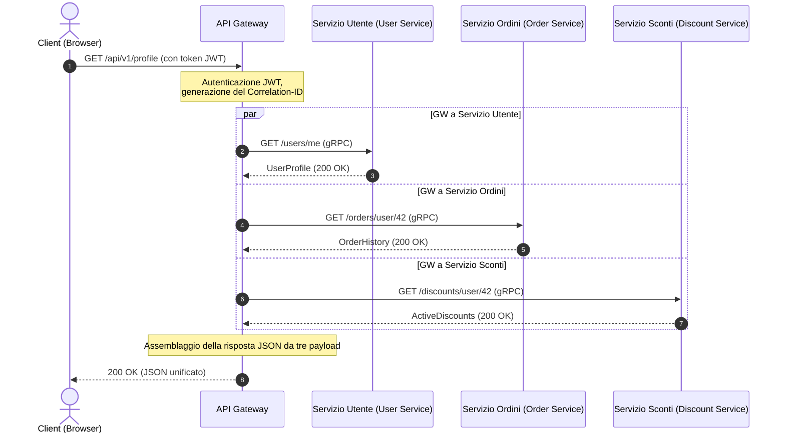

# Dal monolito ai microservizi: Ciclo di vita della richiesta, aggregazione dei dati e tolleranza ai guasti

Immagina questo: Black Friday, picco di traffico. All'improvviso, il carrello dell'utente smette di rispondere e l'intero sito web va offline. Il colpevole? Uno dei server di raccomandazione rallentato di 5 secondi a causa di un memory leak. In un monolito, questo riempirebbe il pool di thread del server web e arresterebbe l'intero sistema. In un sistema distribuito senza adeguate protezioni, un tale guasto scatena un'avalanche a cascata: l'API Gateway si blocca in attesa delle raccomandazioni, trattenendo le connessioni degli utenti ed esaurendo tutte le risorse del sistema in pochi secondi.

La transizione da un monolito ai microservizi viene spesso pubblicizzata come una soluzione magica. Tuttavia, la scalabilità ha un costo in termini di complessità. Invece di un singolo database con query JOIN rapide, otteniamo un'architettura Database-per-Service. Ora, per visualizzare una singola pagina di profilo, dobbiamo recuperare i dati dallo User Service (profilo), dall'Order Service (cronologia acquisti) e dal Discount Service (stato fedeltà). Come orchestriamo questo processo di aggregazione dei dati senza trasformare il nostro sistema in un \"monolito distribuito\" lento e fragile?

Un'aggregazione efficiente dei dati in un'architettura orientata ai servizi richiede un'orchestrazione intelligente a livello di API Gateway, utilizzando l'esecuzione parallela delle richieste e l'isolamento proattivo dei guasti tramite timeout e circuit breaker.

## Indice
* [Decomposizione del monolito: Da un singolo DB a servizi isolati](#decomposing-monolith)
* [API Gateway come orchestratore e aggregatore](#api-gateway-role)
* [Ciclo di vita della richiesta nell'aggregazione dei dati](#request-lifecycle)
* [gRPC sincrono vs RabbitMQ asincrono](#grpc-vs-rabbitmq)
* [Pattern di resilienza: Circuit Breaker e timeout](#resilience-patterns)
* [Scaling delle istanze di servizio sotto carico](#scaling-services)
* [Esempio pratico in PHP](#php-demonstration)
* [Errori comuni](#common-mistakes)
* [Quiz di autovalutazione](#self-check)

---

<a id="decomposing-monolith"></a>
## Decomposizione del monolito: Da un singolo DB a servizi isolati

In un'applicazione monolitica, la chiamata a un metodo di un'altra classe avviene istantaneamente all'interno della memoria dello stesso processo. Quando dividiamo un monolito in microservizi, ogni servizio diventa un processo autonomo con il proprio ciclo di vita e il proprio database privato.

Ciò significa che le classiche query JOIN relazionali tra tabelle di domini diversi non sono più possibili. Consentire a un microservizio di leggere direttamente dal database di un altro servizio viola i confini del contesto delimitato (Bounded Context) e crea un forte accoppiamento a livello di schema. Se il schema del database degli ordini cambia, lo User Service smette di funzionare.

Pertanto, i dati devono essere richiesti esclusivamente tramite API pubbliche dei servizi. Questo introduce il problema dei molteplici round-trip di rete (network roundtrips) e del sovraccarico di serializzazione/deserializzazione.

---

<a id="api-gateway-role"></a>
## API Gateway come orchestratore e aggregatore

Per risolvere la sfida della raccolta dei dati lato client, utilizziamo il **pattern API Gateway**. Invece che un'applicazione mobile o un browser effettuino da 5 a 10 richieste a microservizi diversi, eseguono una singola richiesta al gateway, che effettua l'aggregazione dei dati sul backend.

### API Gateway più popolari:
*   **Kong** (basato su Nginx e Lua/Go) — altamente estensibile con un ricco ecosistema di plugin.
*   **KrakenD** (scritto in Go) — ultra-veloce, ottimizzato per l'aggregazione dichiarativa dei dati senza scrivere codice.
*   **Tyk** (scritto in Go) — gateway flessibile con supporto nativo per l'aggregazione GraphQL.
*   **APISIX** (di Apache) — gateway dinamico basato su OpenResty.

### In cosa dovremmo scrivere un API Gateway?
Sebbene la tentazione di scrivere un API Gateway in PHP sia forte, i gateway in produzione sono in genere scritti in **Go, Rust o Node.js/C++**.

PHP nel suo classico modello di esecuzione (FPM) è bloccante: un processo worker gestisce una singola richiesta alla volta. Se un API Gateway in PHP interroga tre microservizi in parallelo, deve utilizzare curl multi o ReactPHP/Swoole. Tuttavia, Go e Rust offrono un supporto nativo per l'I/O non bloccante (socket asincroni) e thread leggeri (goroutine), consentendo loro di gestire centinaia di migliaia di connessioni simultanee con una RAM minima e una latenza inferiore a 1 millisecondo.

---

<a id="request-lifecycle"></a>
## Ciclo di vita della richiesta nell'aggregazione dei dati

Tracciamo il percorso di una richiesta per la pagina "Dashboard del profilo utente":



1.  **Il client invia una richiesta** all'endpoint `GET /api/v1/profile` con un token di autorizzazione JWT.
2.  **L'API Gateway riceve la richiesta**, valida il token JWT, estrae l'ID utente (ad esempio, `42`) e genera un ID di correlazione unico `Correlation-ID` (o `Trace-ID`) allegato agli header di tutte le successive richieste a valle per il tracciamento distribuito.
3.  **Orchestrazione parallela delle richieste:** Il gateway avvia tre thread paralleli non bloccanti (o goroutine) per chiamare i microservizi a valle:
    *   `GET /users/42`
    *   `GET /orders/user/42`
    *   `GET /discounts/user/42`
4.  **Consolidamento dei risultati:** L'aggregatore del gateway attende il completamento di tutte le chiamate.
    *   *Scenario A (tutti hanno successo):* Tutte le risposte vengono ricevute entro 50 ms. Il gateway assembla un unico documento JSON e lo restituisce al client.
    *   *Scenario B (guasto):* Il Discount Service fallisce con un errore 500. L'orchestratore intercetta l'errore, applica un pattern di *Fallback* (ad esempio, inserisce un elenco di sconti vuoto) e restituisce il profilo utente e gli ordini all'utente, evitando di interrompere l'intera pagina.

---

<a id="grpc-vs-rabbitmq"></a>
## gRPC sincrono vs RabbitMQ asincrono

I microservizi comunicano utilizzando principalmente due pattern:

### 1. Comunicazione sincrona (gRPC, HTTP/REST)
Viene utilizzata quando è necessaria una risposta immediata (come nel caso dell'aggregazione dei dati sull'API Gateway).
*   **gRPC** funziona su **HTTP/2** e utilizza **Protocol Buffers (protobuf)** per la serializzazione binaria. È significativamente più veloce rispetto al classico JSON su HTTP/1.1 grazie al multiplexing delle richieste su una singola connessione TCP e alla compressione degli header.

### 2. Comunicazione asincrona tramite Message Broker (RabbitMQ, Kafka)
Viene utilizzata per operazioni che non richiedono una risposta immediata (ad esempio, effettuare un ordine, inviare e-mail, aggiornare statistiche).
*   Quando un utente fa clic su "Effettua ordine", l'API Gateway invia una richiesta all'Order Service. L'Order Service scrive l'ordine nel proprio database e pubblica un evento `OrderCreated` su RabbitMQ.
*   Il Notification Service e il Delivery Service sono iscritti a questa coda. Leggono l'evento in modo asincrono e avviano l'elaborazione. L'Order Service risponde immediatamente al client: "Ordine accettato per l'elaborazione".

---

<a id="resilience-patterns"></a>
## Pattern di resilienza: Circuit Breaker e timeout

In un sistema distribuito, i guasti di rete sono inevitabili. Senza adeguate protezioni, il rallentamento di un singolo servizio può paralizzare rapidamente l'intera catena di chiamate.

```
Senza Circuit Breaker:
[API Gateway] --(attende 30s)--> [Servizio bloccato] --> Pool di thread esaurito --> Interruzione del sistema ❌

Con Circuit Breaker:
[API Gateway] --(servizio in errore)--> [Circuit Breaker (Aperto)] --> Risposta di fallback istantanea (50ms) ⚠️
```

### Pattern chiave di resilienza:
1.  **Timeout:** Nessuna richiesta a valle dovrebbe bloccarsi indefinitamente (ad esempio, massimo 500 ms). Se un servizio non risponde entro il limite stabilito, la connessione viene interrotta.
2.  **Circuit Breaker (Interruttore automatico):** Una macchina a stati con tre stati:
    *   *Chiuso (Closed):* Le richieste fluiscono normalmente verso il servizio.
    *   *Aperto (Open):* Se il tasso di errore supera una determinata soglia (ad esempio, il 50% in un minuto), il circuito si apre. Le chiamate successive al servizio vengono immediatamente rifiutate a livello di gateway senza effettuare chiamate di rete. Questo dà al servizio in errore il tempo di riprendersi.
    *   *Semiaperto (Half-Open):* Dopo un periodo di raffreddamento, il gateway consente alcune richieste di test. Se queste hanno successo, il circuito si chiude.
3.  **Riprova (Retries):** Reinviare le richieste durante errori temporanei (timeout, errori 503). È fondamentale utilizzare l'Exponential Backoff con Jitter (ritardo esponenziale con rumore casuale) per evitare di inondare di richieste il proprio servizio in fase di ripristino.
4.  **Fallback (Risposta di riserva):** Un percorso di esecuzione alternativo. Se il servizio di raccomandazione è offline, il gateway restituisce un elenco statico di articoli popolari.

---

<a id="scaling-services"></a>
## Scaling delle istanze di servizio sotto carico

In caso di picchi di traffico, i singoli microservizi possono diventare colli di bottiglia. Per scalarli dinamicamente, vengono utilizzati i seguenti meccanismi:

*   **Service Discovery (Rilevamento dei servizi):** Quando una nuova istanza dell'Order Service viene avviata in Docker/Kubernetes, si registra con un registro di servizi (ad esempio, *Consul, Eureka* o il DNS di Kubernetes). L'API Gateway interroga il registro per ottenere gli indirizzi IP attivi.
*   **Load Balancing (Bilanciamento del carico):** Il gateway distribuisce le richieste tra le istanze del servizio utilizzando algoritmi come *Round Robin* o *Least Connections*.
*   **Autoscaling (Scaling automatico):** L'HPA di Kubernetes (Horizontal Pod Autoscaler) monitora le metriche (utilizzo della CPU, della RAM o richieste al secondo) e avvia automaticamente nuovi container quando vengono superate le soglie impostate.

---

<a id="php-demonstration"></a>
## Esempio pratico in PHP

All'interno di una application Laravel, possiamo usare l'HTTP-client-pool per inviare richieste parallele non bloccanti ai servizi a valle. Utilizza l'interfaccia curl multi di Guzzle in background.

Qui viene presentata un'implementazione in PHP di un servizio di aggregazione con limiti di timeout e una logica di fallback (risposta di riserva).

```php
// app/Services/MicroserviceAggregator.php
declare(strict_types=1);

namespace App\Services;

use Illuminate\Http\Client\Pool;
use Illuminate\Support\Facades\Http;
use Illuminate\Support\Facades\Log;

class MicroserviceAggregator
{
    private string $userServiceUrl;
    private string $orderServiceUrl;
    private string $discountServiceUrl;

    public function __construct()
    {
        $this->userServiceUrl = config('services.microservices.user_url', 'http://user-service');
        $this->orderServiceUrl = config('services.microservices.order_url', 'http://order-service');
        $this->discountServiceUrl = config('services.microservices.discount_url', 'http://discount-service');
    }

    /**
     * Rassemble les données complètes du profil utilisateur en parallèle.
     *
     * @param int $userId L'ID de l'utilisateur
     * @param string $correlationId L'ID de corrélation per il traçage distribué
     * @return array<string, mixed>
     */
    public function getAggregatedProfileData(int $userId, string $correlationId): array
    {
        $headers = [
            'X-Correlation-ID' => $correlationId,
            'Accept' => 'application/json',
        ];

        // Esegue richieste parallele non bloccanti
        $responses = Http::pool(fn (Pool $pool) => [
            $pool->as('user')
                ->withHeaders($headers)
                ->timeout(1) // Timeout dopo 1 secondo
                ->get("{$this->userServiceUrl}/users/{$userId}"),

            $pool->as('orders')
                ->withHeaders($headers)
                ->timeout(2) // Timeout dopo 2 secondi
                ->get("{$this->orderServiceUrl}/orders/user/{$userId}"),

            $pool->as('discounts')
                ->withHeaders($headers)
                ->timeout(1) // Timeout dopo 1 secondo
                ->get("{$this->discountServiceUrl}/discounts/user/{$userId}"),
        ]);

        // 1. Elabora il profilo utente (Servizio critico)
        $userResponse = $responses['user'];
        if ($userResponse->failed()) {
            Log::error("Aggregator: Failed to fetch user profile", [
                'userId' => $userId,
                'correlationId' => $correlationId,
                'status' => $userResponse->status(),
                'error' => $userResponse->body()
            ]);

            // Se il servizio critico è in panne, dobbiamo interrompere la richiesta
            throw new \RuntimeException("Critical microservice (User Service) is unavailable.");
        }
        $userProfile = $userResponse->json();

        // 2. Elabora gli ordini (Non critico: fallback su array vuoto in caso di errore)
        $ordersResponse = $responses['orders'];
        $orders = [];
        if ($ordersResponse->successful()) {
            $orders = $ordersResponse->json();
        } else {
            Log::warning("Aggregator: Failed to fetch orders, applying fallback", [
                'userId' => $userId,
                'correlationId' => $correlationId,
                'status' => $ordersResponse->status()
            ]);
        }

        // 3. Elabora gli sconti (Non critico: fallback in caso di errore)
        $discountsResponse = $responses['discounts'];
        $discounts = [];
        if ($discountsResponse->successful()) {
            $discounts = $discountsResponse->json();
        } else {
            Log::warning("Aggregator: Failed to fetch discounts, applying fallback", [
                'userId' => $userId,
                'correlationId' => $correlationId,
                'status' => $discountsResponse->status()
            ]);
        }

        // Restituisce la struttura dati aggregata
        return [
            'user' => $userProfile,
            'orders' => $orders,
            'discounts' => $discounts,
            'aggregated_at' => now()->toIso8601String(),
        ];
    }
}
```

---

## ⚠️ Errori comuni

**1. Catene di richieste sincrone**
Chiamare in modo sincrono `Gateway -> Servizio A -> Servizio B -> Servizio C` vanifica lo scopo dei microservizi. Il tempo di risposta totale diventa la somma di tutte le latenze dei servizi e qualsiasi guasto interrompe l'intera catena. Preferire richieste parallele o la comunicazione asincrona (basata su eventi).

**2. Timeout predefiniti indefiniti**
La mancata specifica dei timeout di rete fa sì che il gateway mantenga aperte le connessioni per servizi a valle che non rispondono. Sotto un carico pesante, ciò causa l'esaurimento del pool di thread e il blocco del gateway.

**3. Mancanza di ID di correlazione (Correlation ID)**
Senza un Trace ID, il debug dei problemi distribuiti è quasi impossibile. L'API Gateway deve assegnare un Correlation ID univoco a ogni richiesta in entrata, passarlo a tutte le chiamate a valle e includerlo in tutte le voci di registro (logs).

---

## 🧠 Quiz di autovalutazione

1. Quale protocollo di trasporto e formato di serializzazione utilizza gRPC per migliorare le prestazioni rispetto a REST JSON?
2. Perché Go è preferito al classico PHP-FPM per gli API Gateway ad alto carico?
3. In quale stato passa un Circuit Breaker quando un servizio a valle inizia a restituire sistematicamente errori 500?

<details>
<summary><b>Mostra le risposte</b></summary>

1. gRPC utilizza **HTTP/2** come protocollo di trasporto (per connessioni multiplexate e persistentes) e **Protocol Buffers (protobuf)** per la serializzazione binaria anziché JSON in testo normale.
2. Go implementa nativamente un ciclo di eventi non bloccante sui socket di sistema e thread leggeri (goroutine), consentendogli di gestire milioni di connessioni simultanee con pochissima RAM. PHP-FPM genera un processo pesante del sistema operativo per ogni singola connessione in entrata, il che scala con difficoltà in presenza di un'elevata concorrenza.
3. Il Circuit Breaker passa allo stato **Aperto (Open)**, restituendo istantaneamente un errore o una risposta di fallback predefinita ai client senza inviare richieste al servizio a valle in panne.
</details>
