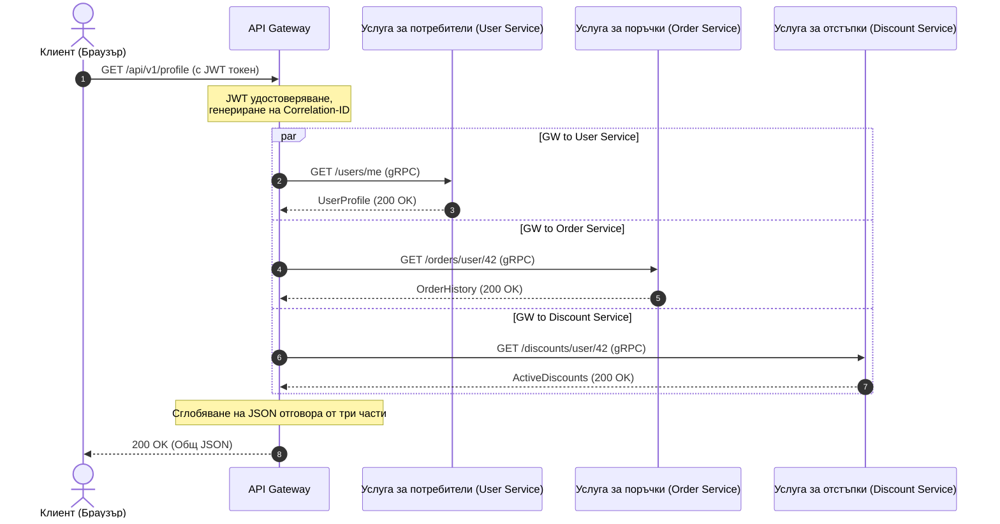

# От монолит към микроуслуги: Жизнен цикъл на заявката, агрегиране на данни и отказноустойчивост

Представете си следното: Черен петък, пик на продажбите. Изведнъж потребителската количка спира да реагира, а след нея пада целият сайт. Причината? Един от сървърите за препоръки се забави с 5 секунди поради изтичане на памет. В един монолит това би довело до препълване на пула от нишки на уеб сървъра и пълно спиране на системата. В разпределените системи без подходяща защита такъв срив причинява каскадна лавина: API Gateway увисва в очакване на препоръките, задържайки връзките на потребителите, и изчерпва всички ресурси за секунди.

Преходът от монолит към микроуслуги често се рекламира като сребърен куршум. Мащабируемостта обаче идва на цената на сложността. Вместо една база данни с бързи JOIN заявки получаваме архитектура Database-per-Service. Сега, за да се покаже една страница на потребителския профил, трябва да се съберат данни от услугата за потребители (профил), услугата за поръчки (история на покупките) и услугата за отстъпки (лоялност). Как да организираме този процес на събиране на данни, без да превърнем системата в бавен и крехък „разпределен монолит“?

Ефективното агрегиране на данни в ориентирана към услуги архитектура изисква интелигентна оркестрация на ниво API Gateway с паралелно изпълнение на заявки и проактивна изолация на повреди чрез тайм-аути и предпазители.

## Съдържание
* [Разделяне на монолита: От една база данни към изолирани услуги](#decomposing-monolith)
* [API Gateway като оркестратор и агрегатор](#api-gateway-role)
* [Жизнен цикъл на заявката при агрегиране на данни](#request-lifecycle)
* [Синхронен gRPC срещу Асинхронен RabbitMQ](#grpc-vs-rabbitmq)
* [Паттерни за отказноустойчивост: Circuit Breaker и тайм-аути](#resilience-patterns)
* [Мащабиране на инстанциите под натоварване](#scaling-services)
* [Практически пример на PHP](#php-demonstration)
* [Типични грешки](#common-mistakes)
* [Въпроси за самопроверка](#self-check)

---

<a id="decomposing-monolith"></a>
## Разделяне на монолита: От една база данни към изолирани услуги

В едно монолитно приложение извикването на метод от един клас в друг става мигновено в паметта на процеса. Когато разделим монолита на микроуслуги, всяка от тях се превръща в автономен процес със собствен жизнен цикъл и собствена база данни.

Това означава, че класическите релационни JOIN заявки между таблици от различни домейни вече не са възможни. Опитът на една микроуслуга да чете директно от базата данни на друга нарушава границите на контекста (Bounded Context) и създава твърда свързаност на ниво схема на данните. Ако структурата на базата данни за поръчки се промени, услугата за потребители ще се срине.

Следователно данните трябва да се изискват изключително чрез публичните API на услугите. Това ражда проблема с множеството мрежови заявки (Network Roundtrips) и разходите за сериализация/десериализация на данните.

---

<a id="api-gateway-role"></a>
## API Gateway като оркестратор и агрегатор

За решаване на проблема със събирането на данни от страна на клиента се използва моделът **API Gateway (API шлюз)**. Вместо мобилното приложение или браузърът да извършват 5–10 заявки към различни микроуслуги, те извършват една заявка към шлюза, който сглобява (агрегира) данните на бекенда.

### Популярни API Gateway:
*   **Kong** (на базата на Nginx и Lua/Go) — разширяем, с богата екосистема от плъгини.
*   **KrakenD** (на Go) — ултрабърз, оптимизиран за декларативно агрегиране на данни без писане на код.
*   **Tyk** (на Go) — гъвкав шлюз с поддръжка на GraphQL агрегиране.
*   **APISIX** (от Apache) — динамичен шлюз на базата на OpenResty.

### На какво да напишем API Gateway?
Въпреки че изкушението да се напише API Gateway на PHP е голямо, в индустрията шлюзовете най-често се пишат на **Go, Rust или Node.js/C++**.

PHP по своята класическа природа (FPM) е блокиращ: един процес обработва една заявка. Ако API Gateway на PHP опрашва паралелно три микроуслуги, той е принуден да използва curl multi или ReactPHP/Swoole. Въпреки това Go и Rust предлагат вградена поддръжка на неблокиращ входно-изходен модел (асинхронни сокети) и леки нишки (горутини), което позволява обработката на стотици хиляди паралелни връзки с минимално потребление на RAM и латентност (latency) под 1 милисекунда.

---

<a id="request-lifecycle"></a>
## Жизнен цикъл на заявката при агрегиране на данни

Нека проследим пътя на заявка към страницата „Личен профил на потребителя“:



1.  **Клиентът изпраща заявка** към ендпоинта `GET /api/v1/profile` с JWT токен за оторизация.
2.  **API Gateway приема заявката**, валидира JWT токена, извлича потребителския ID (например, `42`) и генерира уникален идентификатор `Correlation-ID` (или `Trace-ID`), който се прикачва към заглавките на всички последващи вътрешни заявки за разпределено проследяване.
3.  **Оркестрация на паралелни заявки:** Шлюзът стартира три паралелни неблокиращи нишки (или горутини) за извикване на вътрешните микроуслуги:
    *   `GET /users/42`
    *   `GET /orders/user/42`
    *   `GET /discounts/user/42`
4.  **Събиране на резултатите:** Специален агрегатор на шлюза изчаква приключването на всички извиквания.
    *   *Сценарий А (успешен):* Всички отговори са получени в рамките на 50 ms. Шлюзът формира един общ JSON документ и го връща на клиента.
    *   *Сценарий Б (срив):* Услугата за отстъпки се срива с грешка 500. Оркестраторът улавя грешката, прилага модела *Fallback* (например, подменя списъка с празен такъв) и връща на потребителя профила и поръчките, без да чупи цялата страница.

---

<a id="grpc-vs-rabbitmq"></a>
## Синхронен gRPC срещу Асинхронен RabbitMQ

В микроуслугите съществуват два основни типа комуникация:

### 1. Синхронно взаимодействие (gRPC, HTTP/REST)
Използва се, когато отговорът е необходим веднага (както при агрегирането на данни в API Gateway).
*   **gRPC** използва протокол **HTTP/2** и бинарен формат за сериализация **Protocol Buffers (protobuf)**. Работи многократно по-бързо от класическия JSON over HTTP/1.1 благодарение на мултиплексирането на заявките в една TCP връзка и компресирането на хедърите.

### 2. Асинхронно взаимодействие чрез брокери на съобщения (RabbitMQ, Kafka)
Използва се за операции, които не изискват незабавен отговор (например създаване на поръчка, изпращане на имейл, актуализиране на статистики).
*   Когато потребителят щракне върху „Оформи поръчка“, API Gateway изпраща заявка към Услугата за поръчки. Тя записва поръчката в своята база данни и публикува събитие `OrderCreated` в RabbitMQ.
*   Услугата за известия и Услугата за доставка са абонирани за тази опашка. Те прочитат асинхронно събитието и започват работа. Услугата за поръчки веднага отговаря на клиента: „Поръчката е приета за обработка“.

---

<a id="resilience-patterns"></a>
## Паттерни за отказноустойчивост: Circuit Breaker и тайм-аути

В разпределените системи мрежовите сривове са неизбежни. Без защитни механизми зависването на една услуга бързо парализира цялата верига.

```
Без предпазител:
[API Gateway] --(чака 30 сек)--> [Зависнала услуга] --> Пулът от нишки е зает --> Срив на системата ❌

С предпазител (Circuit Breaker):
[API Gateway] --(услугата не работи)--> [Circuit Breaker (Open)] --> Незабавен fallback отговор (50ms) ⚠️
```

### Ключови модели за защита:
1.  **Тайм-аути (Timeouts):** Нито една вътрешна заявка не трябва да чака отговор по-дълго от зададения лимит (например 500 ms). Ако услугата не отговори, заявката се прекратява.
2.  **Circuit Breaker (Предпазител):** Автомат на състоянията с три режима:
    *   *Closed (Затворен):* Заявките преминават нормално към услугата.
    *   *Open (Отворен):* Ако процентът на грешките надвиши 50% за минута, веригата се отваря. Последващите заявки незабавно се отхвърлят на ниво шлюз без изпращане в мрежата, като се връща грешка или кеш. Това дава време на услугата да се възстанови.
    *   *Half-Open (Полуотворен):* След изтичане на времето за изчакване шлюзът пропуска няколко тестови заявки. Ако те са успешни, веригата се затваря.
3.  **Повторни опити (Retries):** Повторно изпращане на заявка при временни мрежови сривове. Важно е да се използва експоненциално изчакване (Exponential Backoff) с добавяне на случаен шум (Jitter), за да не се претовари възстановяващата се услуга.
4.  **Фоллбек (Fallback):** Резервен сценарий. Ако услугата за препоръки е недостъпна, шлюзът връща статичен списък с популярни продукти.

---

<a id="scaling-services"></a>
## Мащабиране на инстанциите под натоварване

При голям трафик отделни микроуслуги могат да се окажат тясно място. За тяхното динамично мащабиране се прилагат следните механизми:

*   **Service Discovery (Откриване на услуги):** Когато се стартира нова инстанция на услугата за поръчки в Docker/Kubernetes, тя се регистрира в регистър (например *Consul, Eureka* или вградения DNS на Kubernetes). API Gateway прави заявка към регистъра, за да получи актуалните IP адреси.
*   **Балансиране на натоварването (Load Balancing):** Шлюзът разпределя заявките между инстанциите чрез алгоритми като *Round Robin* или *Least Connections*.
*   **Автомащабиране (Autoscaling):** Kubernetes HPA (Horizontal Pod Autoscaler) следи метриките (натоварване на процесора, паметта или брой заявки в секунда) и автоматично стартира нови контейнери при преминаване на праговете.

---

<a id="php-demonstration"></a>
## Практически пример на PHP

В едно Laravel приложение можем да използваме пула на HTTP клиента за паралелно извикване на микроуслуги. Той работи на базата на библиотеката Guzzle и използва неблокиращ cURL-мултидескриптор.

Ето пример за услуга-агрегатор с ограничение на тайм-аута и обработка на грешки чрез резервни сценарии.

```php
// app/Services/MicroserviceAggregator.php
declare(strict_types=1);

namespace App\Services;

use Illuminate\Http\Client\Pool;
use Illuminate\Support\Facades\Http;
use Illuminate\Support\Facades\Log;

class MicroserviceAggregator
{
    private string $userServiceUrl;
    private string $orderServiceUrl;
    private string $discountServiceUrl;

    public function __construct()
    {
        $this->userServiceUrl = config('services.microservices.user_url', 'http://user-service');
        $this->orderServiceUrl = config('services.microservices.order_url', 'http://order-service');
        $this->discountServiceUrl = config('services.microservices.discount_url', 'http://discount-service');
    }

    /**
     * Събира пълните данни за потребителския профил паралелно.
     *
     * @param int $userId Идентификатор на потребителя
     * @param string $correlationId Уникален ID за проследяване на логове
     * @return array<string, mixed>
     */
    public function getAggregatedProfileData(int $userId, string $correlationId): array
    {
        $headers = [
            'X-Correlation-ID' => $correlationId,
            'Accept' => 'application/json',
        ];

        // Стартиране на пул от паралелни неблокиращи заявки
        $responses = Http::pool(fn (Pool $pool) => [
            $pool->as('user')
                ->withHeaders($headers)
                ->timeout(1) // Тайм-аут за връзка и четене - 1 секунда
                ->get("{$this->userServiceUrl}/users/{$userId}"),

            $pool->as('orders')
                ->withHeaders($headers)
                ->timeout(2) // Тайм-аут - 2 секунди
                ->get("{$this->orderServiceUrl}/orders/user/{$userId}"),

            $pool->as('discounts')
                ->withHeaders($headers)
                ->timeout(1) // Тайм-аут - 1 секунда
                ->get("{$this->discountServiceUrl}/discounts/user/{$userId}"),
        ]);

        // 1. Обработка на потребителския профил (Критично важна услуга)
        $userResponse = $responses['user'];
        if ($userResponse->failed()) {
            Log::error("Aggregator: Failed to fetch user profile", [
                'userId' => $userId,
                'correlationId' => $correlationId,
                'status' => $userResponse->status(),
                'error' => $userResponse->body()
            ]);

            // Ако критичната услуга е недостъпна, прекратяваме изпълнението
            throw new \RuntimeException("Critical microservice (User Service) is unavailable.");
        }
        $userProfile = $userResponse->json();

        // 2. Обработка на поръчките (Некритично: при грешка връщаме празен масив)
        $ordersResponse = $responses['orders'];
        $orders = [];
        if ($ordersResponse->successful()) {
            $orders = $ordersResponse->json();
        } else {
            Log::warning("Aggregator: Failed to fetch orders, applying fallback", [
                'userId' => $userId,
                'correlationId' => $correlationId,
                'status' => $ordersResponse->status()
            ]);
        }

        // 3. Обработка на отстъпките (Некритично: при грешка прилагаме fallback)
        $discountsResponse = $responses['discounts'];
        $discounts = [];
        if ($discountsResponse->successful()) {
            $discounts = $discountsResponse->json();
        } else {
            Log::warning("Aggregator: Failed to fetch discounts, applying fallback", [
                'userId' => $userId,
                'correlationId' => $correlationId,
                'status' => $discountsResponse->status()
            ]);
        }

        // Сглобяване на крайния агрегиран отговор
        return [
            'user' => $userProfile,
            'orders' => $orders,
            'discounts' => $discounts,
            'aggregated_at' => now()->toIso8601String(),
        ];
    }
}
```

---

<a id="common-mistakes"></a>
## ⚠️ Типични грешки

**1. Синхронни вериги от заявки**
Веригата `Gateway -> Service A -> Service B -> Service C` обезсмисля микроуслугите. Времето за отговор става сума от закъсненията на всички услуги, а повредата на която и да е от тях прекъсва цялата верига. Заявките трябва да се изпращат паралелно или комуникацията да бъде асинхронна (event-driven).

**2. Безкрайни тайм-аути по подразбиране**
Липсата на изрични тайм-аути води до това, че шлюзът задържа нишки за блокирани услуги. Под голямо натоварване това изчерпва системните ресурси (thread starvation) и води до срив на шлюза.

**3. Игнориране на Correlation ID**
Без Trace ID е невъзможно да се проследи конкретна заявка в разпределената среда. При влизане през Gateway на всяка заявка трябва да се присвои Correlation ID, който да се предава към всички последващи услуги и да се записва в логовете.

---

<a id="self-check"></a>
## 🧠 Въпроси за самопроверка

1. Кой протокол и формат на данните използва gRPC за повишаване на производителността в сравнение с REST JSON?
2. Защо за високо натоварени API Gateway най-често се избира Go, а не класически PHP-FPM?
3. В какво състояние преминава предпазителят (Circuit Breaker), ако целевата микроуслуга започне постоянно да връща грешки 500?

<details>
<summary><b>Покажи отговорите</b></summary>

1. gRPC използва **HTTP/2** (за мултиплексиране на връзките) и бинарна сериализация **Protocol Buffers (protobuf)** вместо текстовия JSON.
2. Go има вграден неблокиращ модел на входно-изходни операции на ниво сокети и леки нишки (горутини), позволявайки паралелна обработка на милиони връзки с минимална RAM. PHP-FPM отделя по един тежък OS процес на всяка връзка, което бързо запълва паметта.
3. Предпазителят преминава в състояние **Open (Отворен)**, блокирайки всички следващи заявки към услугата и незабавно връщайки грешка или fallback на клиента.
</details>
