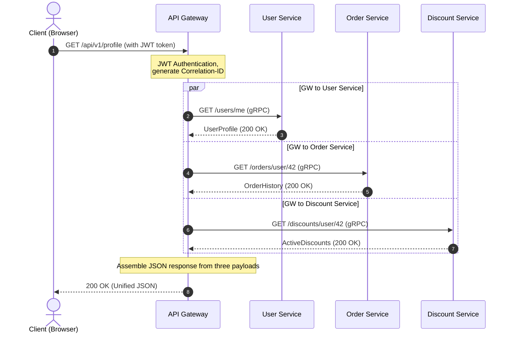

# Monolith to Microservices: Request Lifecycle, Data Aggregation, and Fault Tolerance

Imagine this: Black Friday, peak traffic. Suddenly, the user's shopping cart stops responding, and the entire website goes down. The culprit? One of the recommendation servers slowed down by 5 seconds due to a memory leak. In a monolith, this would fill up the web server's thread pool and halt the entire system. In a distributed system without proper guardrails, such a failure triggers a cascading avalanche: the API Gateway hangs waiting for recommendations, holding onto user connections, and exhausting all system resources in seconds.

Transitioning from a monolith to microservices is often advertised as a silver bullet. However, scalability comes at the cost of complexity. Instead of a single database with fast JOIN queries, we get a Database-per-Service architecture. Now, to render a single profile page, we must fetch data from the User Service (profile), Order Service (purchase history), and Discount Service (loyalty status). How do we orchestrate this data aggregation process without turning our system into a slow, fragile "distributed monolith"?

Efficient data aggregation in a service-oriented architecture requires intelligent orchestration at the API Gateway level, utilizing parallel request execution and proactive fault isolation via timeouts and circuit breakers.

## Table of Contents
* [Decomposing the Monolith: From Single DB to Isolated Services](#decomposing-monolith)
* [API Gateway as the Orchestrator and Aggregator](#api-gateway-role)
* [Request Lifecycle in Data Aggregation](#request-lifecycle)
* [Synchronous gRPC vs Asynchronous RabbitMQ](#grpc-vs-rabbitmq)
* [Resilience Patterns: Circuit Breaker and Timeouts](#resilience-patterns)
* [Scaling Service Instances Under Load](#scaling-services)
* [Practical Example in PHP](#php-demonstration)
* [Common Mistakes](#common-mistakes)
* [Self-Check Quiz](#self-check)

---

<a id="decomposing-monolith"></a>
## Decomposing the Monolith: From Single DB to Isolated Services

In a monolithic application, calling a method from another class happens instantly within the same process memory. When we split a monolith into microservices, each service becomes an autonomous process with its own lifecycle and its own private database.

This means that classic relational JOIN queries across different domain tables are no longer possible. Allowing one microservice to read directly from another service's database violates Bounded Context boundaries and creates tight coupling at the schema level. If the schema of the Order database changes, the User Service breaks.

Therefore, data must be requested exclusively through public service APIs. This introduces the problem of multiple network roundtrips and serialization/deserialization overhead.

---

<a id="api-gateway-role"></a>
## API Gateway as the Orchestrator and Aggregator

To solve the client-side data gathering challenge, we use the **API Gateway pattern**. Instead of a mobile application or browser making 5–10 requests to different microservices, they make a single request to the gateway, which performs data aggregation on the backend.

### Popular API Gateways:
*   **Kong** (built on Nginx and Lua/Go) — highly extensible with a rich ecosystem of plugins.
*   **KrakenD** (written in Go) — ultra-fast, optimized for declarative data aggregation without writing code.
*   **Tyk** (written in Go) — flexible gateway with native GraphQL aggregation support.
*   **APISIX** (by Apache) — dynamic gateway built on OpenResty.

### What should we write an API Gateway in?
While the temptation to write an API Gateway in PHP is high, gateways in production are typically written in **Go, Rust, or Node.js/C++**.

PHP in its classic execution model (FPM) is blocking: one worker process handles one request. If a PHP API Gateway queries three microservices in parallel, it must use curl multi or ReactPHP/Swoole. However, Go and Rust offer native support for non-blocking I/O (asynchronous sockets) and lightweight threads (goroutines), allowing them to handle hundreds of thousands of concurrent connections with minimal RAM and latency under 1 millisecond.

---

<a id="request-lifecycle"></a>
## Request Lifecycle in Data Aggregation

Let's trace a request for the "User Profile Dashboard" page:



1.  **The client sends a request** to the `GET /api/v1/profile` endpoint with a JWT authorization token.
2.  **The API Gateway receives the request**, validates the JWT token, extracts the user ID (e.g., `42`), and generates a unique `Correlation-ID` (or `Trace-ID`) attached to the headers of all subsequent downstream requests for distributed tracing.
3.  **Parallel Request Orchestration:** The gateway spawns three parallel non-blocking threads (or goroutines) to call downstream microservices:
    *   `GET /users/42`
    *   `GET /orders/user/42`
    *   `GET /discounts/user/42`
4.  **Consolidating Results:** The gateway's aggregator waits for all calls to finish.
    *   *Scenario A (all succeed):* All responses are received within 50 ms. The gateway assembles a single JSON document and returns it to the client.
    *   *Scenario B (failure):* The Discount Service fails with a 500 error. The orchestrator catches the error, applies a *Fallback* pattern (e.g., inserts an empty discount list), and returns the user profile and orders to the user, preventing the entire page from breaking.

---

<a id="grpc-vs-rabbitmq"></a>
## Synchronous gRPC vs Asynchronous RabbitMQ

Microservices communicate using two primary patterns:

### 1. Synchronous Communication (gRPC, HTTP/REST)
Used when a response is needed immediately (such as data aggregation on the API Gateway).
*   **gRPC** runs over **HTTP/2** and uses **Protocol Buffers (protobuf)** for binary serialization. It is significantly faster than classic JSON over HTTP/1.1 thanks to multiplexing requests over a single TCP connection and header compression.

### 2. Asynchronous Message Broker Communication (RabbitMQ, Kafka)
Used for operations that do not require an immediate response (e.g., placing an order, sending emails, updating statistics).
*   When a user clicks "Place Order", the API Gateway sends a request to the Order Service. The Order Service writes the order to its DB and publishes an `OrderCreated` event to RabbitMQ.
*   The Notification Service and Delivery Service are subscribed to this queue. They read the event asynchronously and begin processing. The Order Service immediately replies to the client: "Order accepted for processing".

---

<a id="resilience-patterns"></a>
## Resilience Patterns: Circuit Breaker and Timeouts

In a distributed system, network failures are inevitable. Without guardrails, a slowdown in a single service can quickly paralyze the entire call chain.

```
Without a Circuit Breaker:
[API Gateway] --(waits 30s)--> [Hung Service] --> Thread pool exhausted --> System Outage ❌

With a Circuit Breaker:
[API Gateway] --(service failing)--> [Circuit Breaker (Open)] --> Instant fallback reply (50ms) ⚠️
```

### Key Resilience Patterns:
1.  **Timeouts:** No downstream request should block indefinitely (e.g., max 500 ms). If a service does not respond within the limit, the connection is aborted.
2.  **Circuit Breaker:** A state machine with three states:
    *   *Closed:* Requests flow normally to the service.
    *   *Open:* If the error rate exceeds a threshold (e.g., 50% over a minute), the circuit opens. Subsequent calls to the service are immediately rejected at the gateway level without making network requests. This gives the failing service breathing room to recover.
    *   *Half-Open:* After a cool-down period, the gateway allows a few test requests through. If they succeed, the circuit closes.
3.  **Retries:** Resending requests during transient failures (timeouts, 503 errors). It is crucial to use Exponential Backoff with Jitter (random noise) to avoid DDoS-ing your own recovering service.
4.  **Fallback:** An alternative execution path. If the recommendation service is down, the gateway returns a static list of popular items.

---

<a id="scaling-services"></a>
## Scaling Service Instances Under Load

When traffic spikes, individual microservices may become bottlenecks. To scale them dynamically, the following mechanisms are used:

*   **Service Discovery:** When a new instance of the Order Service starts up in Docker/Kubernetes, it registers itself with a service registry (e.g., *Consul, Eureka*, or Kubernetes DNS). The API Gateway queries the registry to obtain active IP addresses.
*   **Load Balancing:** The gateway distributes requests across service instances using algorithms like *Round Robin* or *Least Connections*.
*   **Autoscaling:** Kubernetes HPA (Horizontal Pod Autoscaler) monitors metrics (CPU, RAM utilization, or Requests Per Second) and automatically spins up new containers when thresholds are breached.

---

<a id="php-demonstration"></a>
## Practical Example in PHP

In a Laravel application, we can use the HTTP Client pool to make non-blocking parallel requests to downstream services. It utilizes Guzzle's curl multi interface under the hood.

Here is a PHP implementation of an aggregator service with timeout limits and fallback logic.

```php
// app/Services/MicroserviceAggregator.php
declare(strict_types=1);

namespace App\Services;

use Illuminate\Http\Client\Pool;
use Illuminate\Support\Facades\Http;
use Illuminate\Support\Facades\Log;

class MicroserviceAggregator
{
    private string $userServiceUrl;
    private string $orderServiceUrl;
    private string $discountServiceUrl;

    public function __construct()
    {
        $this->userServiceUrl = config('services.microservices.user_url', 'http://user-service');
        $this->orderServiceUrl = config('services.microservices.order_url', 'http://order-service');
        $this->discountServiceUrl = config('services.microservices.discount_url', 'http://discount-service');
    }

    /**
     * Gathers complete user profile data in parallel.
     *
     * @param int $userId The user ID
     * @param string $correlationId Correlation ID for distributed tracing
     * @return array<string, mixed>
     */
    public function getAggregatedProfileData(int $userId, string $correlationId): array
    {
        $headers = [
            'X-Correlation-ID' => $correlationId,
            'Accept' => 'application/json',
        ];

        // Execute parallel non-blocking requests
        $responses = Http::pool(fn (Pool $pool) => [
            $pool->as('user')
                ->withHeaders($headers)
                ->timeout(1) // Timeout after 1 second
                ->get("{$this->userServiceUrl}/users/{$userId}"),

            $pool->as('orders')
                ->withHeaders($headers)
                ->timeout(2) // Timeout after 2 seconds
                ->get("{$this->orderServiceUrl}/orders/user/{$userId}"),

            $pool->as('discounts')
                ->withHeaders($headers)
                ->timeout(1) // Timeout after 1 second
                ->get("{$this->discountServiceUrl}/discounts/user/{$userId}"),
        ]);

        // 1. Process User Profile (Critical service)
        $userResponse = $responses['user'];
        if ($userResponse->failed()) {
            Log::error("Aggregator: Failed to fetch user profile", [
                'userId' => $userId,
                'correlationId' => $correlationId,
                'status' => $userResponse->status(),
                'error' => $userResponse->body()
            ]);

            // If the critical service is down, we must abort the request
            throw new \RuntimeException("Critical microservice (User Service) is unavailable.");
        }
        $userProfile = $userResponse->json();

        // 2. Process Orders (Non-critical: fallback to empty array on failure)
        $ordersResponse = $responses['orders'];
        $orders = [];
        if ($ordersResponse->successful()) {
            $orders = $ordersResponse->json();
        } else {
            Log::warning("Aggregator: Failed to fetch orders, applying fallback", [
                'userId' => $userId,
                'correlationId' => $correlationId,
                'status' => $ordersResponse->status()
            ]);
        }

        // 3. Process Discounts (Non-critical: fallback on failure)
        $discountsResponse = $responses['discounts'];
        $discounts = [];
        if ($discountsResponse->successful()) {
            $discounts = $discountsResponse->json();
        } else {
            Log::warning("Aggregator: Failed to fetch discounts, applying fallback", [
                'userId' => $userId,
                'correlationId' => $correlationId,
                'status' => $discountsResponse->status()
            ]);
        }

        // Return aggregated data structure
        return [
            'user' => $userProfile,
            'orders' => $orders,
            'discounts' => $discounts,
            'aggregated_at' => now()->toIso8601String(),
        ];
    }
}
```

---

<a id="common-mistakes"></a>
## ⚠️ Common Mistakes

**1. Synchronous Request Chains**
Calling `Gateway -> Service A -> Service B -> Service C` synchronously defeats the purpose of microservices. Total response time becomes the sum of all service latencies, and any failure breaks the whole chain. Prefer parallel requests or asynchronous (event-driven) communication.

**2. Indefinite Default Timeouts**
Failing to specify network timeouts leads to the gateway holding connections for unresponsive downstream services. Under heavy load, this causes thread starvation and crashes the gateway.

**3. Missing Correlation IDs**
Without a Trace ID, debugging distributed issues is nearly impossible. The API Gateway must assign a unique Correlation ID to every incoming request, pass it to all downstream calls, and include it in all log entries.

---

<a id="self-check"></a>
## 🧠 Self-Check Quiz

1. What transport protocol and serialization format does gRPC use to improve performance over REST JSON?
2. Why is Go preferred over classic PHP-FPM for high-load API Gateways?
3. Which state does a Circuit Breaker switch to when a downstream service starts returning 500 errors consistently?

<details>
<summary><b>Show Answers</b></summary>

1. gRPC uses **HTTP/2** as its transport protocol (for multiplexed, persistent connections) and **Protocol Buffers (protobuf)** for binary serialization instead of plain-text JSON.
2. Go natively implements a non-blocking event loop on system sockets and lightweight threads (goroutines), allowing it to handle millions of connections concurrently with very little RAM. PHP-FPM spawns a heavy OS process for every single incoming connection, which scales poorly under massive concurrency.
3. The Circuit Breaker switches to the **Open** state, instantly returning an error or a default fallback response to clients without sending requests to the failing downstream service.
</details>
