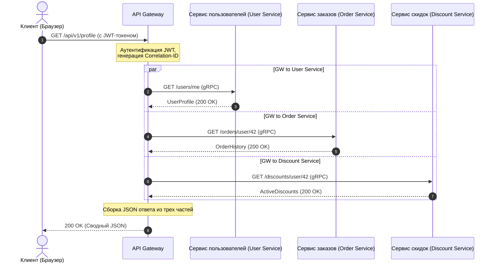

# От монолита к микросервисам: Жизненный цикл запроса, агрегация данных и отказоустойчивость

Представьте себе: Черная пятница, пик распродаж. Вдруг корзина покупателя перестает отвечать, а за ней ложится весь сайт. Причина? Один из серверов рекомендаций замедлился на 5 секунд из-за утечки памяти. В монолите это привело бы к переполнению пула потоков веб-сервера и полной остановке системы. В распределенных системах без должной защиты такой сбой вызывает каскадную лавину: API-гейтвей зависает в ожидании рекомендаций, удерживая соединения пользователей, и за считанные секунды исчерпывает все ресурсы.

Переход от монолита к микросервисам часто рекламируют как серебряную пулю. Однако за масштабируемость приходится платить сложностью. Вместо единой БД с быстрыми JOIN-запросами мы получаем архитектуру Database-per-Service. Теперь, чтобы отобразить одну страницу личного кабинета, нужно собрать данные из сервиса пользователей (профиль), сервиса заказов (история покупок) и сервиса скидок (лояльность). Как организовать этот процесс сбора данных так, чтобы не превратить систему в медленный и хрупкий «распределенный монолит»?

Эффективное агрегирование данных в сервис-ориентированной архитектуре требует интеллектуальной оркестрации на уровне API Gateway с параллельным выполнением запросов и изоляцией сбоев с помощью тайм-аутов и предохранителей.

## Содержание
* [Разделение монолита: От единой БД к изолированным сервисам](#decomposing-monolith)
* [API Gateway как оркестратор и агрегатор](#api-gateway-role)
* [Жизненный цикл запроса при агрегации данных](#request-lifecycle)
* [Синхронный gRPC vs Асинхронный RabbitMQ](#grpc-vs-rabbitmq)
* [Паттерны отказоустойчивости: Circuit Breaker и тайм-ауты](#resilience-patterns)
* [Масштабирование инстансов под нагрузкой](#scaling-services)
* [Практический пример на PHP](#php-demonstration)
* [Типичные ошибки](#common-mistakes)
* [Вопросы для самопроверки](#self-check)

---

<a id="decomposing-monolith"></a>
## Разделение монолита: От единой БД к изолированным сервисам

В монолитном приложении вызов метода одного класса из другого происходит мгновенно в памяти процесса. Когда мы разделяем монолит на микросервисы, каждый из них становится автономным процессом с собственным жизненным циклом и собственной базой данных. 

Это означает, что классические реляционные JOIN-запросы между таблицами разных доменов больше невозможны. Попытка одного микросервиса читать напрямую из БД другого сервиса нарушает границы контекста (Bounded Context) и создает жесткую связность на уровне схемы данных. Если база данных сервиса заказов изменит свою структуру, сервис пользователей сломается.

Следовательно, данные должны запрашиваться исключительно через публичные API сервисов. Это порождает проблему множественных сетевых вызовов (Network Roundtrips) и накладных расходов на сериализацию/десериализацию данных.

---

<a id="api-gateway-role"></a>
## API Gateway как оркестратор и агрегатор

Для решения проблемы сборки данных на стороне клиента используется паттерн **API Gateway (Шлюз API)**. Вместо того чтобы мобильное приложение или браузер совершали 5–10 запросов к разным микросервисам, они совершают один запрос к шлюзу, который выполняет сборку (агрегацию) данных на стороне бэкенда.

### Популярные API Gateway:
*   **Kong** (на базе Nginx и Lua/Go) — расширяемый, с богатой экосистемой плагинов.
*   **KrakenD** (на Go) — ультрабыстрый, оптимизированный для декларативной агрегации данных без написания кода.
*   **Tyk** (на Go) — гибкий шлюз с поддержкой GraphQL сборки.
*   **APISIX** (от Apache) — динамический шлюз на базе OpenResty.

### На чем писать API Gateway?
Хотя искушение написать API Gateway на PHP велико, в индустрии шлюзы чаще пишут на **Go, Rust или Node.js/C++**. 

PHP по своей классической природе (FPM) блокирующий: один процесс обрабатывает один запрос. Если API Gateway на PHP опрашивает параллельно три микросервиса, он вынужден использовать curl multi или ReactPHP/Swoole. Однако Go и Rust предлагают нативную поддержку неблокирующего ввода-вывода (асинхронные сокеты) и легковесные потоки (горутины), что позволяет обрабатывать сотни тысяч параллельных соединений с минимальным потреблением оперативной памяти и задержкой (latency) менее 1 миллисекунды.

---

<a id="request-lifecycle"></a>
## Жизненный цикл запроса при агрегации данных

Рассмотрим путь запроса к странице «Личный кабинет пользователя»:



1.  **Клиент отправляет запрос** на эндпоинт `GET /api/v1/profile` с JWT-токеном авторизации.
2.  **API Gateway принимает запрос**, валидирует JWT-токен, извлекает ID пользователя (например, `42`) и генерирует уникальный сквозной идентификатор `Correlation-ID` (или `Trace-ID`), который прикрепляется к заголовкам всех последующих внутренних запросов для распределенного трассирования.
3.  **Оркестрация параллельных запросов:** Шлюз запускает три параллельных неблокирующих потока (или горутины) для вызова внутренних микросервисов:
    *   `GET /users/42`
    *   `GET /orders/user/42`
    *   `GET /discounts/user/42`
4.  **Сбор результатов:** Специальный агрегатор на шлюзе ожидает завершения всех вызовов. 
    *   *Сценарий А (все успешно):* Все ответы получены за 50 мс. Шлюз формирует единый JSON-документ и отдает его клиенту.
    *   *Сценарий Б (сбой):* Сервис скидок упал с ошибкой 500. Оркестратор отлавливает ошибку, применяет паттерн *Fallback* (например, подставляет пустой список скидок) и отдает пользователю профиль и заказы, не ломая всю страницу.

---

<a id="grpc-vs-rabbitmq"></a>
## Синхронный gRPC vs Асинхронный RabbitMQ

В микросервисах существует два основных типа коммуникации:

### 1. Синхронное взаимодействие (gRPC, HTTP/REST)
Используется, когда ответ нужен здесь и сейчас (как при агрегации данных на API Gateway).
*   **gRPC** использует протокол **HTTP/2** и бинарный формат сериализации **Protocol Buffers (protobuf)**. Он работает в разы быстрее классического JSON over HTTP/1.1 благодаря мультиплексированию запросов в одном TCP-соединении и сжатию заголовков.

### 2. Асинхронное взаимодействие через брокеры сообщений (RabbitMQ, Kafka)
Используется для операций, не требующих мгновенного ответа (например, оформление заказа, отправка писем, обновление статистики).
*   Когда пользователь нажимает «Оформить заказ», API Gateway отправляет запрос в Сервис заказов. Сервис заказов записывает заказ в свою БД и публикует событие `OrderCreated` в RabbitMQ.
*   Сервис уведомлений и Сервис доставки подписаны на эту очередь. Они асинхронно считывают событие и начинают свою работу. Сервис заказов при этом сразу возвращает клиенту ответ: «Заказ принят в обработку».

---

<a id="resilience-patterns"></a>
## Паттерны отказоустойчивости: Circuit Breaker и тайм-ауты

В распределенной системе сетевые сбои неизбежны. Без защитных механизмов зависание одного сервиса мгновенно парализует всю цепочку вызовов.

```
Без предохранителя:
[API Gateway] --(ждет 30 сек)--> [Зависший Сервис] --> Пул потоков забит --> Отказ всей системы ❌

С предохранителем (Circuit Breaker):
[API Gateway] --(сервис лежит)--> [Circuit Breaker (Open)] --> Мгновенный дефолтный ответ (50мс) ⚠️
```

### Ключевые паттерны защиты:
1.  **Тайм-ауты (Timeouts):** Ни один внутренний запрос не должен ожидать ответа дольше установленного лимита (например, 500 мс). Если сервис не ответил, запрос прерывается.
2.  **Circuit Breaker (Предохранитель):** Автомат состояний, имеющий три режима:
    *   *Closed (Закрыт):* Запросы идут к сервису в штатном режиме.
    *   *Open (Разомкнут):* Если процент ошибок за минуту превысил 50%, цепь размыкается. Все последующие запросы к сервису мгновенно отклоняются на уровне шлюза без отправки в сеть, возвращая ошибку или кэш. Это дает упавшему сервису время на восстановление.
    *   *Half-Open (Полуразомкнут):* По истечении времени восстановления шлюз пропускает несколько тестовых запросов. Если они успешны, цепь закрывается.
3.  **Повторные попытки (Retries):** Повторная отправка запроса при временных сетевых сбоях (сетевой таймаут, ошибка 503). Важно использовать экспоненциальную задержку (Exponential Backoff) с добавлением случайного шума (Jitter), чтобы не устроить DDoS-атаку на собственный восстанавливающийся сервис.
4.  **Фоллбэк (Fallback):** Резервный сценарий. Если сервис рекомендаций недоступен, шлюз возвращает статичный список популярных товаров.

---

<a id="scaling-services"></a>
## Масштабирование инстансов под нагрузкой

При росте трафика отдельные микросервисы могут перестать справляться с нагрузкой. Для их динамического масштабирования применяются следующие механизмы:

*   **Service Discovery (Обнаружение сервисов):** Когда поднимается новый инстанс сервиса заказов в Docker/Kubernetes, он регистрируется в реестре сервисов (например, *Consul, Eureka* или встроенный DNS Kubernetes). API Gateway обращается к реестру, чтобы узнать актуальные IP-адреса работающих инстансов.
*   **Балансировка нагрузки (Load Balancing):** Шлюз распределяет запросы между инстансами по алгоритмам *Round Robin* или *Least Connections*.
*   **Автомасштабирование (Autoscaling):** Kubernetes HPA (Horizontal Pod Autoscaler) отслеживает метрики (загрузка CPU, памяти или количество запросов в секунду) и автоматически запускает новые контейнеры (инстансы) при превышении пороговых значений.

---

<a id="php-demonstration"></a>
## Практический пример на PHP

В Laravel-приложении для параллельного сбора данных из микросервисов мы можем использовать пул HTTP-клиента. Он работает на базе библиотеки Guzzle и использует неблокирующий cURL-мультидескриптор для одновременного выполнения запросов.

Ниже представлен пример сервиса-агрегатора, который опрашивает три микросервиса параллельно с ограничением тайм-аута и обработкой сбоев через фоллбэки.

```php
// app/Services/MicroserviceAggregator.php
declare(strict_types=1);

namespace App\Services;

use Illuminate\Http\Client\Pool;
use Illuminate\Support\Facades\Http;
use Illuminate\Support\Facades\Log;

class MicroserviceAggregator
{
    private string $userServiceUrl;
    private string $orderServiceUrl;
    private string $discountServiceUrl;

    public function __construct()
    {
        $this->userServiceUrl = config('services.microservices.user_url', 'http://user-service');
        $this->orderServiceUrl = config('services.microservices.order_url', 'http://order-service');
        $this->discountServiceUrl = config('services.microservices.discount_url', 'http://discount-service');
    }

    /**
     * Собирает полные данные профиля пользователя параллельно.
     *
     * @param int $userId Идентификатор пользователя
     * @param string $correlationId Сквозной ID для трассировки логов
     * @return array<string, mixed>
     */
    public function getAggregatedProfileData(int $userId, string $correlationId): array
    {
        $headers = [
            'X-Correlation-ID' => $correlationId,
            'Accept' => 'application/json',
        ];

        // Запуск пула параллельных неблокирующих запросов
        $responses = Http::pool(fn (Pool $pool) => [
            $pool->as('user')
                ->withHeaders($headers)
                ->timeout(1) // Тайм-аут соединения и чтения - 1 секунда
                ->get("{$this->userServiceUrl}/users/{$userId}"),

            $pool->as('orders')
                ->withHeaders($headers)
                ->timeout(2) // Тайм-аут - 2 секунды
                ->get("{$this->orderServiceUrl}/orders/user/{$userId}"),

            $pool->as('discounts')
                ->withHeaders($headers)
                ->timeout(1) // Тайм-аут - 1 секунда
                ->get("{$this->discountServiceUrl}/discounts/user/{$userId}"),
        ]);

        // 1. Обработка профиля пользователя (Критически важный сервис)
        $userResponse = $responses['user'];
        if ($userResponse->failed()) {
            Log::error("Aggregator: Failed to fetch user profile", [
                'userId' => $userId,
                'correlationId' => $correlationId,
                'status' => $userResponse->status(),
                'error' => $userResponse->body()
            ]);

            // Если основной сервис недоступен, мы не можем собрать ответ
            throw new \RuntimeException("Critical microservice (User Service) is unavailable.");
        }
        $userProfile = $userResponse->json();

        // 2. Обработка заказов (Не критично: при сбое вернем пустой массив)
        $ordersResponse = $responses['orders'];
        $orders = [];
        if ($ordersResponse->successful()) {
            $orders = $ordersResponse->json();
        } else {
            Log::warning("Aggregator: Failed to fetch orders, applying fallback", [
                'userId' => $userId,
                'correlationId' => $correlationId,
                'status' => $ordersResponse->status()
            ]);
        }

        // 3. Обработка скидок (Не критично: при сбое применим фоллбэк)
        $discountsResponse = $responses['discounts'];
        $discounts = [];
        if ($discountsResponse->successful()) {
            $discounts = $discountsResponse->json();
        } else {
            Log::warning("Aggregator: Failed to fetch discounts, applying fallback", [
                'userId' => $userId,
                'correlationId' => $correlationId,
                'status' => $discountsResponse->status()
            ]);
        }

        // Сборка итогового агрегированного ответа
        return [
            'user' => $userProfile,
            'orders' => $orders,
            'discounts' => $discounts,
            'aggregated_at' => now()->toIso8601String(),
        ];
    }
}
```

---

<a id="common-mistakes"></a>
## ⚠️ Типичные ошибки

**1. Синхронные цепочки вызовов**
Цепочка вызовов `Gateway -> Service A -> Service B -> Service C` сводит на нет все преимущества микросервисов. Время ответа складывается из задержек всех сервисов, а отказ любого из них ломает всю цепь. Запросы должны отправляться параллельно, либо общение должно быть асинхронным (event-driven).

**2. Бесконечные тайм-ауты по умолчанию**
Отказ от явной конфигурации таймаутов на сетевых запросах приводит к тому, что шлюз резервирует потоки под зависшие запросы. Под нагрузкой это приводит к исчерпанию ресурсов (thread starvation) и отказу шлюза.

**3. Игнорирование Correlation ID**
Без сквозного логирования невозможно понять, почему упал конкретный пользовательский запрос. При прохождении через Gateway каждому запросу должен присваиваться уникальный Trace ID, который прокидывается во все микросервисы и записывается во все логи.

---

<a id="self-check"></a>
## 🧠 Вопросы для самопроверки

1. Какой протокол и формат данных использует gRPC для повышения производительности по сравнению с REST JSON?
2. Почему для высоконагруженных API Gateway чаще выбирают язык Go, а не классический PHP-FPM?
3. В какое состояние переходит предохранитель (Circuit Breaker), если целевой микросервис начинает отвечать ошибками 500 для каждого запроса?

<details>
<summary><b>Показать ответы</b></summary>

1. gRPC использует транспортный протокол **HTTP/2** (с поддержкой мультиплексирования соединений) и бинарную сериализацию **Protocol Buffers (protobuf)** вместо текстового JSON.
2. Go использует неблокирующую модель ввода-вывода (событийный цикл на системных сокетах) и ультралегкие потоки (горутины), что позволяет удерживать миллионы соединений параллельно с минимальным объемом оперативной памяти. PHP-FPM по умолчанию выделяет один тяжелый процесс ОС на каждое входящее соединение, что быстро расходует память.
3. Предохранитель переходит в состояние **Open (Разомкнут)**, блокируя все последующие запросы к упавшему сервису и мгновенно возвращая ошибку или запасной ответ (fallback) клиенту.
</details>
