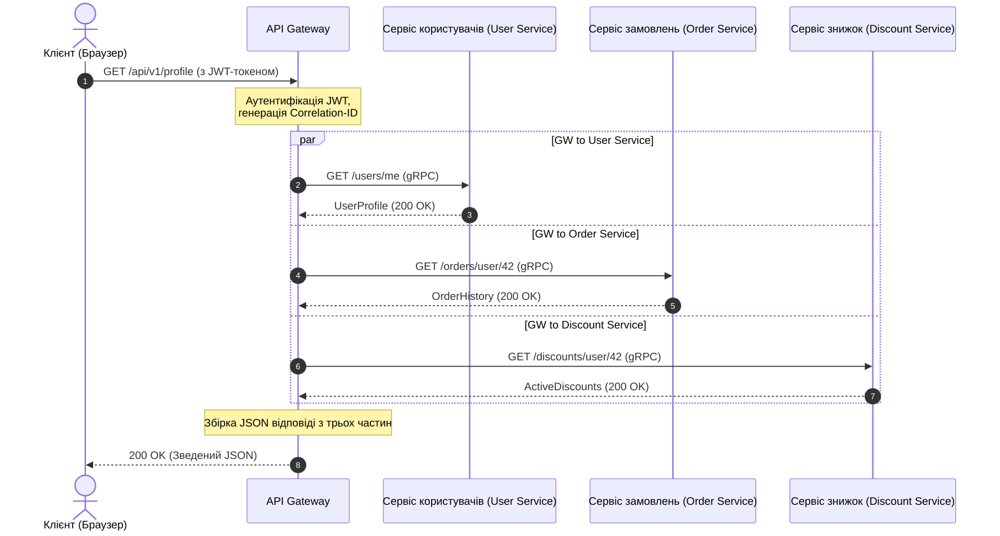

# Від моноліту до мікросервісів: Життєвий цикл запиту, агрегація даних та відмовостійкість

Уявіть собі: Чорна п'ятниця, пік розпродажів. Раптом кошик покупця перестає відповідати, а за ним лягає весь сайт. Причина? Один із серверів рекомендацій уповільнився на 5 секунд через витік пам'яті. У моноліті це призвело б до переповнення пулу потоків веб-сервера та повної зупинки системи. У розподілених системах без належного захисту такий збій викликає каскадну лавину: API-гейтвей зависає в очікуванні рекомендацій, утримуючи з'єднання користувачів, і за лічені секунди вичерпує всі ресурси.

Перехід від моноліту до мікросервісів часто рекламують як срібну кулю. Однак за масштабованість доводиться платити складністю. Замість єдиної БД зі швидкими JOIN-запитами ми отримуємо архітектуру Database-per-Service. Тепер, щоб відобразити одну сторінку особистого кабінету, потрібно зібрати дані з сервісу користувачів (профіль), сервісу замовлень (історія покупок) та сервісу знижок (лояльність). Як організувати цей процес збору даних так, щоб не перетворити систему на повільний та крихкий «розподілений моноліт»?

Ефективне агрегування даних у сервіс-орієнтованій архітектурі вимагає інтелектуальної оркестрації на рівні API Gateway з паралельним виконанням запитів та ізоляцією збоїв за допомогою тайм-аутів та запобіжників.

## Зміст
* [Розділення моноліту: Від єдиної БД до ізольованих сервісів](#decomposing-monolith)
* [API Gateway як оркестратор та агрегатор](#api-gateway-role)
* [Життєвий цикл запиту при агрегації даних](#request-lifecycle)
* [Синхронний gRPC vs Асинхронний RabbitMQ](#grpc-vs-rabbitmq)
* [Патерни відмовостійкості: Circuit Breaker та тайм-аути](#resilience-patterns)
* [Масштабування інстансів під навантаженням](#scaling-services)
* [Практичний приклад на PHP](#php-demonstration)
* [Типові помилки](#common-mistakes)
* [Вопросы для самопроверки](#self-check)

---

<a id="decomposing-monolith"></a>
## Розділення монолиту: Від єдиної БД до ізольованих сервісів

У монолітному додатку виклик методу одного класу з іншого відбувається миттєво в пам'яті процесу. Коли ми розділяємо моноліт на мікросервіси, кожен з них стає автономним процесом із власним життєвим циклом та власною базою даних.

Це означає, що класичні реляційні JOIN-запити між таблицями різних доменів більше неможливі. Спроба одного мікросервісу читати безпосередньо з БД іншого сервісу порушує межі контексту (Bounded Context) та створює жорстку зв'язність на рівні схеми даних. Якщо база даних сервісу замовлень змінить свою структуру, сервіс користувачів зламається.

Отже, дані мають запитуватися виключно через публічні API сервісів. Це породжує проблему множинних мережевих викликів (Network Roundtrips) та накладних витрат на серіалізацію/десеріалізацію даних.

---

<a id="api-gateway-role"></a>
## API Gateway як оркестратор та агрегатор

Для вирішення проблеми збору даних на стороні клієнта використовується патерн **API Gateway (Шлюз API)**. Замість того щоб мобільний додаток або браузер здійснювали 5–10 запитів до різних мікросервісів, вони здійснюють один запит до шлюзу, який виконує збірку (агрегацію) даних на стороні бекенду.

### Популярні API Gateway:
*   **Kong** (на базі Nginx та Lua/Go) — розширюваний, з багатою екосистемою плагінів.
*   **KrakenD** (на Go) — ультрашвидкий, оптимізований для декларативної агрегації даних без написання коду.
*   **Tyk** (на Go) — гнучкий шлюз із підтримкою GraphQL збірки.
*   **APISIX** (від Apache) — динамічний шлюз на базі OpenResty.

### На чому писати API Gateway?
Хоча спокуса написати API Gateway на PHP велика, в індустрії шлюзи частіше пишуть на **Go, Rust або Node.js/C++**.

PHP за своєю класичною природою (FPM) блокуючий: один процес обробляє один запит. Якщо API Gateway на PHP опитує паралельно три мікросервіси, він змушений використовувати curl multi або ReactPHP/Swoole. Однак Go та Rust пропонують нативну підтримку неблокуючого введення-виведення (асинхронні сокети) та легковажні потоки (горутини), що дозволяє обробляти сотні тисяч паралельних з'єднань із мінімальним споживанням оперативної пам'яті та затримкою (latency) менше 1 мілісекунди.

---

<a id="request-lifecycle"></a>
## Життєвий цикл запиту при агрегації даних

Розглянемо шлях запиту до сторінки «Особистий кабінет користувача»:



1.  **Клієнт надсилає запит** на ендпоінт `GET /api/v1/profile` з JWT-токеном авторизації.
2.  **API Gateway приймає запит**, валідує JWT-токен, вилучає ID користувача (наприклад, `42`) та генерує унікальний наскрізний ідентифікатор `Correlation-ID` (або `Trace-ID`), який прикріплюється до заголовків усіх наступних внутрішніх запитів для розподіленого трасування.
3.  **Оркестрація паралельних запитів:** Шлюз запускає три паралельні неблокуючі потоки (або горутини) для виклику внутрішніх мікросервісів:
    *   `GET /users/42`
    *   `GET /orders/user/42`
    *   `GET /discounts/user/42`
4.  **Збір результатів:** Спеціальний агрегатор на шлюзі очікує завершення всіх викликів.
    *   *Сценарій А (все успішно):* Усі відповіді отримані за 50 мс. Шлюз формує єдиний JSON-документ і віддає його клієнту.
    *   *Сценарій Б (збій):* Сервіс знижок упав з помилкою 500. Оркестратор відловлює помилку, застосовує патерн *Fallback* (наприклад, підставляє порожній список знижок) і віддає користувачеві профіль та замовлення, не ламаючи всю сторінку.

---

<a id="grpc-vs-rabbitmq"></a>
## Синхронний gRPC vs Асинхронний RabbitMQ

У мікросервісах існує два основних типи комунікації:

### 1. Синхронна взаємодія (gRPC, HTTP/REST)
Використовується, коли відповідь потрібна тут і зараз (як при агрегації даних на API Gateway).
*   **gRPC** використовує протокол **HTTP/2** та бінарний формат серіалізації **Protocol Buffers (protobuf)**. Він працює в рази швидше за класичний JSON over HTTP/1.1 завдяки мультиплексуванню запитів в одному TCP-з'єднанні та стисненню заголовків.

### 2. Асинхронна взаємодія через брокери повідомлень (RabbitMQ, Kafka)
Використовується для операцій, що не потребують миттєвої відповіді (наприклад, оформлення замовлення, відправка листів, оновлення статистики).
*   Коли користувач натискає «Оформити замовлення», API Gateway надсилає запит у Сервіс замовлень. Сервіс замовлень записує замовлення у свою БД і публікує подію `OrderCreated` у RabbitMQ.
*   Сервіс повідомлень та Сервіс доставки підписані на цю чергу. Вони асинхронно зчитують подію і починають свою роботу. Сервіс замовлень при цьому відразу повертає клієнту відповідь: «Замовлення прийнято в обробку».

---

<a id="resilience-patterns"></a>
## Патерни відмовостійкості: Circuit Breaker та тайм-аути

У розподіленій системі мережеві збої неминучі. Без захисних механізмів зависання одного сервісу миттєво паралізує весь ланцюжок викликів.

```
Без запобіжника:
[API Gateway] --(чекає 30 сек)--> [Завислий Сервіс] --> Пул потоків забитий --> Відмова всієї системи ❌

З запобіжником (Circuit Breaker):
[API Gateway] --(сервіс лежить)--> [Circuit Breaker (Open)] --> Миттєва дефолтна відповідь (50мс) ⚠️
```

### Ключові патерни захисту:
1.  **Тайм-аути (Timeouts):** Жоден внутрішній запит не повинен очікувати відповіді довше встановленого ліміту (наприклад, 500 мс). Якщо сервіс не відповів, запит переривається.
2.  **Circuit Breaker (Запобіжник):** Автомат станів, що має три режими:
    *   *Closed (Закритий):* Запити йдуть до сервісу в штатному режимі.
    *   *Open (Розімкнутий):* Якщо відсоток помилок за хвилину перевищив 50%, ланцюг розмикається. Усі наступні запити до сервісу миттєво відхиляються на рівні шлюзу без відправки в мережу, повертаючи помилку або кеш. Це дає сервісу, що впав, час на відновлення.
    *   *Half-Open (Напіврозімкнутий):* Після закінчення часу відновлення шлюз пропускає кілька тестових запитів. Якщо вони успішні, ланцюг закривається.
3.  **Повторні спроби (Retries):** Повторне надсилання запиту при тимчасових мережевих збоях (мережевий таймаут, помилка 503). Важливо використовувати експоненціальну затримку (Exponential Backoff) з додаванням випадкового шуму (Jitter), щоб не влаштувати DDoS-атаку на власний сервіс, що відновлюється.
4.  **Фоллбек (Fallback):** Резервний сценарій. Якщо сервіс рекомендацій недоступний, шлюз повертає статичний список популярних товарів.

---

<a id="scaling-services"></a>
## Масштабування інстансів під навантаженням

При зростанні трафіку окремі мікросервіси можуть перестати справлятися з навантаженням. Для їх динамічного масштабування застосовуються такі механізми:

*   **Service Discovery (Виявлення сервісів):** Коли піднімається новий інстанс сервісу замовлень у Docker/Kubernetes, він реєструється в реєстрі сервісів (наприклад, *Consul, Eureka* або вбудований DNS Kubernetes). API Gateway звертається до реєстру, щоб дізнатися актуальні IP-адреси працюючих інстансів.
*   **Балансування навантаження (Load Balancing):** Шлюз розподіляє запити між інстансами за алгоритмами *Round Robin* или *Least Connections*.
*   **Автомасштабування (Autoscaling):** Kubernetes HPA (Horizontal Pod Autoscaler) відстежує метрики (завантаження CPU, пам'яті або кількість запитів на секунду) і автоматично запускає нові контейнери (інстанси) при перевищенні порогових значень.

---

<a id="php-demonstration"></a>
## Практичний приклад на PHP

У Laravel-додатку для паралельного збору даних із мікросервісів ми можемо використовувати пул HTTP-клієнта. Він працює на базі бібліотеки Guzzle і використовує неблокуючий cURL-мультидескриптор для одночасного виконання запитів.

Нижче представлено приклад сервісу-агрегатора, який опитує три мікросервіси паралельно з обмеженням тайм-ауту та обробкою збоїв через фоллбеки.

```php
// app/Services/MicroserviceAggregator.php
declare(strict_types=1);

namespace App\Services;

use Illuminate\Http\Client\Pool;
use Illuminate\Support\Facades\Http;
use Illuminate\Support\Facades\Log;

class MicroserviceAggregator
{
    private string $userServiceUrl;
    private string $orderServiceUrl;
    private string $discountServiceUrl;

    public function __construct()
    {
        $this->userServiceUrl = config('services.microservices.user_url', 'http://user-service');
        $this->orderServiceUrl = config('services.microservices.order_url', 'http://order-service');
        $this->discountServiceUrl = config('services.microservices.discount_url', 'http://discount-service');
    }

    /**
     * Збирає повні дані профілю користувача паралельно.
     *
     * @param int $userId Ідентифікатор користувача
     * @param string $correlationId Наскрізний ID для трасування логів
     * @return array<string, mixed>
     */
    public function getAggregatedProfileData(int $userId, string $correlationId): array
    {
        $headers = [
            'X-Correlation-ID' => $correlationId,
            'Accept' => 'application/json',
        ];

        // Запуск пулу паралельних неблокуючих запитів
        $responses = Http::pool(fn (Pool $pool) => [
            $pool->as('user')
                ->withHeaders($headers)
                ->timeout(1) // Тайм-аут з'єднання та читання - 1 секунда
                ->get("{$this->userServiceUrl}/users/{$userId}"),

            $pool->as('orders')
                ->withHeaders($headers)
                ->timeout(2) // Тайм-аут - 2 секунди
                ->get("{$this->orderServiceUrl}/orders/user/{$userId}"),

            $pool->as('discounts')
                ->withHeaders($headers)
                ->timeout(1) // Тайм-аут - 1 секунда
                ->get("{$this->discountServiceUrl}/discounts/user/{$userId}"),
        ]);

        // 1. Обробка профілю користувача (Критично важливий сервіс)
        $userResponse = $responses['user'];
        if ($userResponse->failed()) {
            Log::error("Aggregator: Failed to fetch user profile", [
                'userId' => $userId,
                'correlationId' => $correlationId,
                'status' => $userResponse->status(),
                'error' => $userResponse->body()
            ]);

            // Якщо основний сервіс недоступний, ми не можемо зібрати відповідь
            throw new \RuntimeException("Critical microservice (User Service) is unavailable.");
        }
        $userProfile = $userResponse->json();

        // 2. Обробка замовлень (Не критично: при збої повернемо порожній масив)
        $ordersResponse = $responses['orders'];
        $orders = [];
        if ($ordersResponse->successful()) {
            $orders = $ordersResponse->json();
        } else {
            Log::warning("Aggregator: Failed to fetch orders, applying fallback", [
                'userId' => $userId,
                'correlationId' => $correlationId,
                'status' => $ordersResponse->status()
            ]);
        }

        // 3. Обробка знижок (Не критично: при збої застосуємо фоллбек)
        $discountsResponse = $responses['discounts'];
        $discounts = [];
        if ($discountsResponse->successful()) {
            $discounts = $discountsResponse->json();
        } else {
            Log::warning("Aggregator: Failed to fetch discounts, applying fallback", [
                'userId' => $userId,
                'correlationId' => $correlationId,
                'status' => $discountsResponse->status()
            ]);
        }

        // Збирання підсумкової агрегованої відповіді
        return [
            'user' => $userProfile,
            'orders' => $orders,
            'discounts' => $discounts,
            'aggregated_at' => now()->toIso8601String(),
        ];
    }
}
```

---

<a id="common-mistakes"></a>
## ⚠️ Типові помилки

**1. Синхронні ланцюжки викликів**
Ланцюжок викликів `Gateway -> Service A -> Service B -> Service C` зводить нанівець усі переваги мікросервісів. Час відповіді складається з затримок всіх сервісів, а відмова будь-якого з них ламає весь ланцюг. Запити повинні надсилатися паралельно, або спілкування має бути асинхронним (event-driven).

**2. Нескінченні тайм-аути за замовчуванням**
Відмова від явної конфігурації таймаутів на мережевих запитах призводить до того, що шлюз резервує потоки під завислі запити. Під навантаженням це призводить до вичерпання ресурсів (thread starvation) та відмови шлюзу.

**3. Ігнорування Correlation ID**
Без наскрізного логування неможливо зрозуміти, чому впав конкретний користувацький запит. При проходженні через Gateway кожному запиту має присвоюватися унікальний Trace ID, який прокидається у всі мікросервіси та записується у всі логи.

---

<a id="self-check"></a>
## 🧠 Вопросы для самопроверки

1. Який протокол і формат даних використовує gRPC для підвищення продуктивності порівняно з REST JSON?
2. Чому для високонавантажених API Gateway частіше обирають мову Go, а не класичний PHP-FPM?
3. У який стан переходить запобіжник (Circuit Breaker), якщо цільовий мікросервіс починає відповідати помилками 500 для кожного запиту?

<details>
<summary><b>Показати відповіді</b></summary>

1. gRPC використовує транспортний протокол **HTTP/2** (з підтримкою мультиплексування з'єднань) та бінарну серіалізацію **Protocol Buffers (protobuf)** замість текстового JSON.
2. Go використовує неблокуючу модель введення-виведення (подієвий цикл на системних сокетах) та ультралегкі потоки (горутини), що дозволяє утримувати мільйони з'єднань паралельно з мінімальним обсягом оперативної пам'яті. PHP-FPM за замовчуванням виділяє один важкий процес ОС на кожне вхідне з'єднання, що швидко витрачає пам'ять.
3. Запобіжник переходить у стан **Open (Розімкнутий)**, блокуючи всі наступні запити до сервісу, що впав, і миттєво повертаючи помилку або запасну відповідь (fallback) клієнту.
</details>
